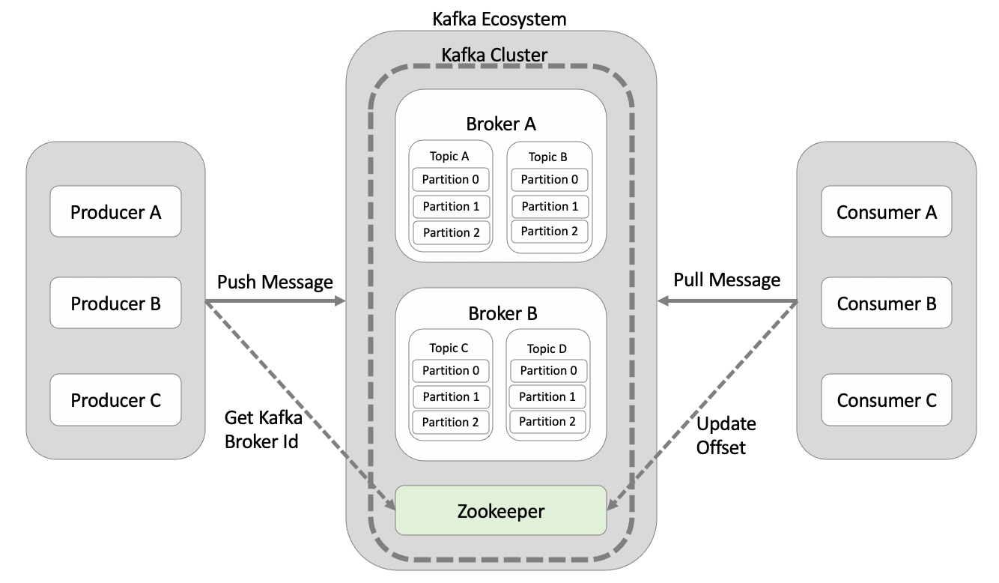
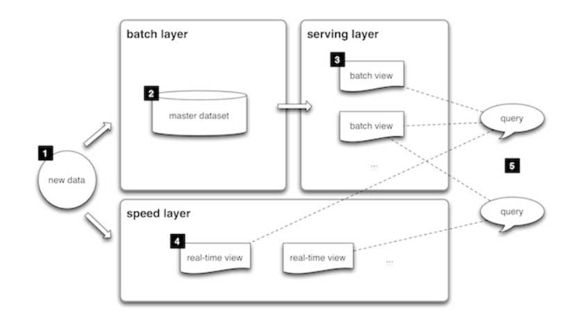

## 카프카의 탄생
2011년, 구인/구칙 및 동종업계의 동향을 살펴볼 수 있는 사이트인 `링크트인`에서 파편화된 데이터 수집 및 분배 아키텍쳐를 운영하는데 큰 어렴울 껶었다.  
  
데이터를 생성하고 적재하기 위해서는 데이터를 생성하는 소스 어플리케이션과 데이터가 최종 적재되는 타킷 애플리케이션을 연결해야한다.  
  
초기 운영 시에는 단방향 통신을 통해 소스 애플리케이션에서 타킷 애플리케이션으로 연동하는 소스코드를 작성했고 복잡하지 않았기에 운영이 힘들지 않았다.  
  
그러나 시간이 지날수록 아키텍처는 거대하지고 소스 애플리케이션과 타킷 애플리케이션의 개수가 많아지면서 문제가 발생했다.  
  
이를 해결하기 위해 링크드인 데이터팀은 기존에 나와있던 메세지 플랫폼과 ETL툴 을 이용해서 이를 개선하려 했지만 파이프라인의 복잡도를 낮춰주는 아키텍처가 되지는 못했다.  
  
### 탄생
결국, 데이터팀은 신규 시스템을 만들기로 결정했고 그 결과물이 아파치 카프카(Apache Kafka)이다.  
  
카프카는 각각의 애플리케이션 끼리 연결하여 데이터를 처리하는 것이 아니라 **한 곳에 모아 처리**할 수 있도록 **중앙 집중화** 했다.

### **주요 설계 목표**

- **고성능**:
    - 초당 수백만 개의 메시지를 처리할 수 있도록 설계되었습니다.
- **확장성**:
    - 분산 시스템으로 설계되어 노드를 추가함으로써 처리량을 손쉽게 확장할 수 있습니다.
- **내구성**:
    - 데이터는 디스크에 저장되며, 장애가 발생해도 복구 가능하도록 설계되었습니다.
- **유연성**:
    - 다양한 소비자 애플리케이션이 데이터를 처리할 수 있도록 독립적인 데이터 읽기와 쓰기를 지원합니다.

---
  
### 내부 구조
  
출처:https://techblog.gccompany.co.kr/apache-kafka%EB%A5%BC-%EC%82%AC%EC%9A%A9%ED%95%98%EC%97%AC-eda-%EC%A0%81%EC%9A%A9%ED%95%98%EA%B8%B0-bf263c79efd0


데이터 파이프라인에서 **1:1 매칭 구조**로 설계되고 운영되었기 때문에, **한쪽 애플리케이션에서 발생한 문제가 다른 애플리케이션에도 영향을 주는 상황이 자주 발생했다**

> **데이터 파이프라인의 1:1 매칭 구조란?**
>
> - **1:1 매칭** 구조는 데이터 파이프라인에서 한 소스 시스템(예: 데이터 생성 애플리케이션)과 하나의 타겟 시스템(예: 데이터 처리 애플리케이션)이 서로 직접적으로 연결된 구조를 의미합니다.
> - 소스에서 데이터를 생성하고, 타겟이 이를 직접 받아 처리하는 방식입니다.
>
> ### **예시**
>
> - 애플리케이션 A가 데이터를 생성하고, 애플리케이션 B가 이를 받아 처리.
> - A → B의 관계는 **직접적**이고, 중간에 완충 역할을 하는 시스템이 없음.

하지만 카프카는 이러한 의존도를 타파 하였다. 이제 소스 애플리케이션에서 생성되는 데이터는 어느 타킷 애플리케이션으로 보낼 것인지 고민하지 않고 일단 카프카로 넣으면 된다. 내부적으로 데이터가 저장 되는 파티션의 동작은 FIFO(FirstInFirstOut)방식의 큐 자료구조와 유사하다.

이때 데이터를 보내 것이 `프로듀서` 이고 큐에서 데이터를 가져가는 것이 `컨슈머` 이다.

이때 카프카에 보내는 데이터를 `토픽` 이라고 하고 이는 RDB에서 테이블과 유사한 개념이라고 볼 수 있다.

### 파티션

**이 토픽은 1개이상의 파티션으로 이루어져 있다.**
Kafka의 파티션(Partition)은 Kafka 토픽(Topic)을 구성하는 **데이터 단위**입니다. 토픽은 여러 파티션으로 나뉘며, 각 파티션은 독립적인 데이터 로그(log)로 동작합니다. 이를 통해 Kafka는 **확장성**, **성능 향상**, **병렬 처리**를 제공합니다.

- **토픽(Topic)**: 메시지를 그룹화하는 Kafka의 논리적 카테고리.
- **파티션(Partition)**: 하나의 토픽은 1개 이상의 파티션으로 구성됩니다.
  - 예: 토픽 `user-activity`가 3개의 파티션으로 나뉘면, `user-activity`는 `Partition 0`, `Partition 1`, `Partition 2`로 나뉩니다.
  - 각 파티션은 데이터를 별도로 저장하고 관리합니다.

### **파티션의 특징**

1. **데이터 로그 구조**:
  - 파티션은 **순차적인 로그 파일**처럼 동작합니다.
  - 각 메시지는 오프셋(offset)이라는 고유한 ID를 가지며, 이를 통해 메시지의 순서를 보장합니다.
  - 메시지는 삭제되기 전까지 **FIFO(First In, First Out)** 순서로 유지됩니다.
2. **병렬 처리**:
  - 파티션은 Kafka 클러스터의 여러 브로커에 분산될 수 있습니다.
  - 이를 통해 데이터 처리를 병렬화하여 성능을 향상시킬 수 있습니다.
3. **파티션 수 결정**:
  - 파티션 수는 토픽을 생성할 때 정의됩니다.
  - 파티션 수가 많을수록 더 많은 병렬 처리가 가능하지만, 너무 많으면 관리가 어려워질 수 있습니다.

### **파티션과 리더-팔로워 구조**

- **리더 파티션(Leader Partition)**:
  - 각 파티션은 리더라는 주요 노드를 가지고 있으며, 데이터의 읽기/쓰기가 리더에서 이루어집니다.
- **팔로워 파티션(Follower Partition)**:
  - 리더의 데이터를 복제하여 장애 발생 시 리더를 대체할 수 있습니다.

---

### **파티션의 장점**

1. **확장성**:
  - 각 파티션은 Kafka 클러스터의 브로커에 분산되므로, 데이터를 병렬로 처리할 수 있습니다.
  - 클러스터에 노드를 추가하면 쉽게 확장 가능합니다.
2. **내결함성**:
  - 파티션은 복제를 통해 장애 상황에서도 데이터를 복구할 수 있습니다.
3. **순서 보장**:
  - 특정 파티션 내에서는 메시지 순서가 보장됩니다.

---

### **예시**

Kafka에서 `{hello world}`라는 메시지를 특정 토픽으로 전달했을 때, Kafka가 이를 처리하는 과정을 예시를 통해 단계별로 설명하겠습니다.

---

### **상황 설정**

- 메시지: `{hello world}`
- 토픽: `example-topic`
- 토픽의 파티션 수: 3개 (Partition 0, Partition 1, Partition 2)
- 메시지의 키(key): 없음 (Round Robin 방식으로 파티션 할당)

---

### **1. 프로듀서가 메시지 전송**

- 애플리케이션(프로듀서)이 Kafka 클러스터에 `{hello world}`라는 메시지를 `example-topic`으로 보냅니다.
- 만약 메시지에 **키(key)**가 없으면, Kafka는 메시지를 라운드 로빈(Round Robin) 방식으로 파티션에 분배합니다.

---

### **2. 메시지의 파티션 할당**

- `example-topic`에는 3개의 파티션이 있습니다.
- Kafka는 `{hello world}` 메시지를 라운드 로빈 방식으로 **Partition 0**, **Partition 1**, 또는 **Partition 2** 중 하나에 할당합니다.
- 예를 들어, `{hello world}` 메시지가 **Partition 1**에 할당되었다고 가정해 보겠습니다.

---

### **3. 파티션에 메시지 저장**

- **Partition 1**의 데이터 로그에 `{hello world}`가 추가됩니다.
- 각 메시지는 고유한 **오프셋(offset)**으로 식별됩니다.
- 예를 들어, **Partition 1**의 데이터 로그 상태는 다음과 같습니다:

    ```mathematica
    Partition 1:
    [Offset 0] Message A
    [Offset 1] {hello world}
    [Offset 2] Message B
    ```


### **4. 메시지 소비**

- Kafka 소비자(Consumer)가 토픽 `example-topic`을 구독하고, **Partition 1**에서 메시지를 읽습니다.
- 소비자는 **오프셋(offset)**을 기준으로 메시지를 순차적으로 처리합니다.
  - 처음에는 **Offset 0**의 메시지를 읽고,
  - 다음으로 **Offset 1**의 `{hello world}` 메시지를 읽습니다.

---

### **요약**

- **파티션**은 Kafka 토픽의 세분화된 데이터 단위로, 데이터를 저장하고 병렬 처리를 가능하게 합니다.
- 파티션 수를 적절히 설정하면 **성능**, **확장성**, **내결함성**을 향상시킬 수 있습니다.
- 각 파티션은 오프셋을 통해 데이터의 순서를 보장하며, 클러스터 내 여러 브로커에 분산됩니다.
  
### 카프카가 데이터 파이프라인으로 적합한 이유

### **데이터 파이프라인이란?**

- **데이터 파이프라인(Data Pipeline)**은 데이터를 생성, 변환, 처리, 저장, 그리고 소비하는 일련의 프로세스를 자동화한 시스템입니다. 이는 원천 데이터(source)로부터 목적지(destination)까지 데이터를 이동시키는 모든 단계를 포함합니다.

### **구성 요소**

1. **데이터 소스**: 데이터를 생성하는 시스템 (예: 데이터베이스, IoT 장치, 로그 파일 등).
2. **데이터 처리**: 데이터를 변환하거나 분석하는 단계 (예: ETL(Extract, Transform, Load) 또는 스트림 처리).
3. **데이터 목적지**: 데이터를 저장하거나 사용하는 시스템 (예: 데이터 웨어하우스, 애플리케이션, 대시보드).

---

### **2. 데이터 파이프라인의 주요 기능**

- **데이터 이동**: 소스에서 목적지로 데이터를 효율적으로 전달.
- **데이터 변환**: 목적지에서 필요로 하는 형식으로 데이터를 처리.
- **실시간 처리**: 데이터를 생성하자마자 바로 처리하거나 분석.
- **확장성**: 대규모 데이터의 흐름을 지원.

### Kafka가 데이터 파이프라인에 적합한 이유

1. **높은 처리량**
   1. 카프카는 프로듀서가 브로커로 데이터를 보낼 때와 컨슈머가 브로커로부터 받을때 모두 묶어서 전송
      1. 많은 양의 데이터를 송수신할 때 발생하는 네트워크 비용을 줄일 수 있다.
   2. 파티션 단위를 통해 동일 목적의 데이터를 여러 파티션에 분배하고 이를 병렬 처리할 수 있다.
      1. 파티션의 개수만큼 컨슈머 개수를 늘려서 동일 시간당 데이터 처리량을 증가(scale-out)
2. **확장성**
   1. 데이터 파이프라인에서 데이터가 얼마나 들어올지 예측하기 어렵다.
      1. 가변적인 상황에서도 안정적으로 확정 가능
      2. 데이터가 적을때는 최소한의 개수로 운영하다가 많아지면 클러스터의 브로커 개수를 자연스럽게 늘려 스케일 아웃(scale-out)할 수 있다. 반대로 줄어드는 경우에는 스케일 인(scale-in)도 가능하다.
      3. 365일 24시간 운영되는 커머스나 은행 같은 비즈니스 모델에서도 안정적

> **브로커(Broker)란?**
>
>
> Kafka에서 **브로커(Broker)**는 메시지를 저장하고 관리하며, 프로듀서(Producer)와 소비자(Consumer) 간의 데이터를 중계하는 역할을 수행하는 **Kafka 서버**를 의미합니다.
>
> Kafka는 분산 시스템으로 설계되었기 때문에 하나 이상의 브로커로 구성되며, 각각의 브로커는 클러스터 내에서 특정 역할을 수행합니다.
>
1. **영속성**
   1. **영속성이란** 프로그램이 종료되더라도 **사라지지 않은 데이터의 특성**을 뜻한다.
   2. 타 플랫폼과 다르게 데이터를 메모리에 저장하지 않고 파일 시스템에 저장
      1. 파일 시스템에 데이터를 적재하는 것은 보편적으로 느리다고 생각하지만, **운영체제 레벨에서 최대한 활용하는 방법을 적용**해서 파일 I/O 성능 향상을 위해 **페이지 캐시** 영역을 메모리에 따로 생성하여 사용
      2. 페이지 캐시 메모리를 사용하여 **한번 읽은 파일 내용은 메모리에 저장** 후 다시 재사용하기 때문에 **처리량이 높다**.
   3. 디스크 기반 파일 시스템을 사용하여 장애 발생으로 종료되더라도 안전하게 데이터를 다시 처리할 수 있다.
2. **고가용성**
   1. 3개 이상 서버로 운영되는 카프카 클러스터는 일부 서버장애가 발생하더라도 무중단으로 안전하고 지속적으로 데이터 처리가 가능
   2. 클러스터로 이루어진 카프카는 데이터 복제를 통해 고가용성의 특징을 가진다.
      1. 3개의 브로커 운영되는 카프카 클러스터는 프로듀서가 메세지를 보내면 1개의 브로커에 저장되는 것이 아니라 해당 메세지가 복제가되어 브로커2 와 브로커3에도 저장된다.
  

### 초기 데이터 플랫폼
### 초기 빅데이터 플랫폼에 대

### 1. 초기 빅데이터 플랫폼의 구조와 한계

### 1.1 End-to-End 배치 방식의 데이터 수집

- **구조 개요**:초기 빅데이터 플랫폼은 각 서비스 애플리케이션에서 발생하는 데이터를 **배치(batch)** 방식으로 모으는 **end-to-end** 구조를 사용했습니다.
    - **End-to-End**라는 표현은 데이터가 애플리케이션에서 생성되어 최종 데이터 웨어하우스나 분석 플랫폼에 도달하기까지의 전체 파이프라인을 의미합니다.
    - 데이터는 일정 시간 간격(예: 매 시간, 매일 또는 주기적)으로 모아서 처리되며, 이를 통해 대용량 데이터를 한꺼번에 분석할 수 있게 됩니다.

### 1.2 배치 처리 구조의 한계

1. **실시간 데이터 전달의 어려움**:
    - 배치 처리 방식은 데이터를 일정 주기로 모아서 처리하기 때문에, 실시간 혹은 거의 실시간으로 생성되는 데이터를 즉각적으로 분석하거나 전달하기 어렵습니다.
    - 예를 들어, 실시간 모니터링, 실시간 추천 시스템, 이벤트 기반 알림 등 빠른 대응이 필요한 서비스에는 적합하지 않습니다.
2. **데이터 히스토리 관리의 어려움**:
    - 원천(raw) 데이터를 기초로 하여 다양한 가공 및 변환 과정을 거쳐 파생 데이터를 만들어 내는 경우, 원본 데이터와 파생 데이터 간의 관계를 추적하기가 어렵습니다.
    - 여러 단계의 배치 처리와 데이터 변환이 누적되면, 언제 어떤 변환이 이루어졌는지, 원본 데이터와 파생 데이터 간의 연관성을 파악하기 힘들어집니다.
    - 이러한 상황은 나중에 데이터의 신뢰성 검증, 감사(audit) 또는 재분석(reprocessing)이 필요할 때 큰 장애물이 됩니다.
3. **데이터 파편화**:
    - 지속적으로 데이터 가공 및 변환 작업이 진행되면서 데이터의 형태, 저장 위치, 접근 방식이 다양해지고 분산됩니다.
    - 이로 인해 각 데이터 소스와 파생 데이터들이 분산되어 관리되기 때문에, 전체 데이터의 일관성과 통합 관리가 어려워집니다.
    - 데이터가 여러 저장소와 형식으로 나뉘면, 전체 데이터를 대상으로 하는 분석이나 정책 수립, 보안 관리에 있어 큰 혼란이 발생할 수 있습니다.

---

### 2. 데이터 거버넌스 (Data Governance)란?

### 2.1 데이터 거버넌스의 정의

- **데이터 거버넌스**는 조직 내에서 데이터를 **효과적으로 관리**, **보호**, **품질 보증**하는 일련의 프로세스, 정책, 표준, 역할 및 책임을 의미합니다.
- 단순히 데이터를 저장하고 분석하는 것을 넘어, 데이터의 **신뢰성, 일관성, 보안**을 확보하여 비즈니스 가치로 전환하는 데 중요한 역할을 합니다.

### 2.2 데이터 거버넌스의 주요 구성 요소

1. **정책 및 표준 수립**:
    - 데이터 수집, 저장, 가공, 배포 및 삭제에 관한 명확한 가이드라인과 표준을 마련합니다.
    - 예를 들어, 어떤 데이터는 암호화하여 저장해야 하는지, 어느 주기로 데이터 품질 검증을 수행할 것인지 등의 정책을 정합니다.
2. **데이터 품질 관리**:
    - 데이터의 정확성, 완전성, 일관성, 최신성 등을 지속적으로 모니터링하고 보증하는 체계를 마련합니다.
    - 데이터가 잘못 가공되거나 손실되는 경우 이를 즉시 파악하여 수정할 수 있도록 합니다.
3. **데이터 보안 및 프라이버시**:
    - 데이터에 대한 접근 권한 관리, 데이터 암호화, 개인정보 보호 정책 등을 수립하여 민감한 정보가 유출되지 않도록 합니다.
    - 데이터의 흐름과 저장 과정에서 발생할 수 있는 보안 위협을 예방하는 체계가 필요합니다.
4. **메타데이터 관리**:
    - 각 데이터에 대한 출처, 변환 이력, 사용처 등을 기록하여 데이터의 생명주기와 연관성을 명확하게 관리합니다.
    - 이를 통해 원천 데이터와 파생 데이터 간의 관계를 추적하고, 데이터의 출처 및 변경 이력을 관리할 수 있습니다.
5. **조직 내 역할 및 책임 정의**:
    - 데이터 관리에 관여하는 각 부서와 담당자, 데이터 스튜어드(Data Steward) 등의 역할을 명확히 정의합니다.
    - 누가 어떤 데이터를 관리하고, 문제가 발생했을 때 누구에게 보고할 것인지를 사전에 정리합니다.

### 2.3 데이터 거버넌스의 중요성

- **신뢰성 있는 의사결정**:
    - 고품질의 데이터가 보장되어야만 경영진 및 비즈니스 부서가 올바른 의사결정을 내릴 수 있습니다.
- **규제 준수**:
    - 개인정보 보호법, GDPR 등 다양한 법적 규제에 따라 데이터를 적절히 관리해야 합니다.
- **효율적인 운영**:
    - 데이터가 분산되어 파편화되면, 데이터를 찾고 분석하는 데 소요되는 시간이 증가하여 비즈니스 운영에 악영향을 미칩니다.
- **위험 관리**:
    - 데이터 유출이나 부정확한 데이터로 인한 피해를 미연에 방지할 수 있습니다.

---

### 3. 초기 플랫폼 구조와 데이터 거버넌스의 연관성

초기 빅데이터 플랫폼은 데이터 수집이 배치 방식으로 이루어졌기 때문에, 실시간 데이터 분석이나 즉각적인 대응이 어려웠습니다. 또한, 배치 처리 과정에서 데이터 가공이 반복되면서 데이터의 변환 이력 및 원천 데이터와의 관계가 명확하지 않아 **데이터 품질** 및 **데이터 일관성**을 보장하기 어려웠습니다.

이러한 상황에서는 **데이터 거버넌스**가 제대로 확립되지 않으면 다음과 같은 문제가 발생할 수 있습니다.

- **데이터 신뢰성 저하**: 데이터의 변환 과정과 히스토리가 제대로 관리되지 않으면, 나중에 데이터 분석 결과에 대해 신뢰할 수 없게 됩니다.
- **보안 및 규제 준수의 어려움**: 데이터가 여러 시스템과 저장소에 분산되어 있으면, 보안 정책이나 규제 준수를 효과적으로 적용하기 어렵습니다.
- **운영 효율성 저하**: 파편화된 데이터는 데이터 통합, 분석, 보고 등 다양한 업무에 있어서 중복 작업이나 비효율성을 초래합니다.

따라서, 빅데이터 플랫폼이 발전하면서 **실시간 데이터 처리 기술**(예: 스트리밍 처리, 이벤트 기반 아키텍처)과 함께 **통합 데이터 관리 시스템** 및 **강력한 데이터 거버넌스 체계**를 도입하여 데이터의 신뢰성, 보안, 일관성을 보장하는 것이 필수적입니다.

---

### 결론

초기 빅데이터 플랫폼은 end-to-end 배치 방식으로 데이터를 수집하여 대용량 데이터를 처리하는 데 초점을 맞췄지만, 실시간 데이터 전달이 어렵고 데이터 가공 과정에서 히스토리 관리 및 데이터 파편화 문제로 인해 전체 데이터의 신뢰성과 일관성을 유지하기 어려웠습니다.

이러한 문제를 해결하기 위해서는 **데이터 거버넌스** 체계를 확립하여 데이터 정책, 품질, 보안, 메타데이터 관리, 역할 분담 등을 체계적으로 관리할 필요가 있으며, 이를 통해 데이터가 올바르게 관리되고 활용될 수 있도록 해야 합니다.

### 람다 아키텍쳐

람다 아키텍처(Lambda Architecture)는 대규모 데이터 처리 시스템에서 **실시간 처리와 배치 처리의 장점을 결합**하여 데이터의 신뢰성과 처리 속도를 동시에 달성하기 위해 고안된 아키텍처 패턴입니다. 이 아키텍처는 주로 빅데이터 처리 환경에서 사용되며, 다음과 같은 세 가지 주요 계층으로 구성됩니다.

---

## 1. 주요 구성 요소

### 1.1 배치 계층 (Batch Layer)

- **목적**:전체 데이터의 **정확한 집계**와 **역사적 분석**을 담당합니다.
- **특징**:
    - 모든 원시 데이터를 저장하고 있으며, 이를 기반으로 주기적으로 배치 작업을 수행하여 정확한 결과를 산출합니다.
    - 계산 결과는 보통 **완전한 뷰**(Complete View)를 생성하며, 시간이 지나도 변하지 않는 **불변 데이터**로 관리됩니다.
    - 데이터 처리 시간은 길더라도 **정확도**와 **일관성**을 보장합니다.
- **예시 기술**:Hadoop, Spark Batch, MapReduce 등

### 1.2 속도 계층 (Speed Layer)

- **목적**:배치 계층의 결과가 나오기 전까지 **실시간 데이터 처리**를 통해 최신 데이터를 빠르게 제공하는 역할을 합니다.
- **특징**:
    - 스트리밍 데이터를 빠르게 처리하여 **실시간 뷰**(Real-Time View)를 생성합니다.
    - 처리 결과는 배치 계층의 결과와 합쳐져 최종 사용자에게 제공되지만, 상대적으로 정확도나 정밀도에서는 배치 계층보다 낮을 수 있습니다.
    - *지연 시간(Latency)**를 최소화하여, 최신 데이터를 즉시 반영하는 것이 핵심입니다.
- **예시 기술**:Apache Storm, Apache Spark Streaming, Apache Flink 등

### 1.3 서빙 계층 (Serving Layer)

- **목적**:배치 계층과 속도 계층의 결과를 **합쳐서 최종 사용자에게 제공**하는 역할을 합니다.
- **특징**:
    - 배치 계층에서 계산된 완전한 데이터 뷰와 속도 계층에서 계산된 최신 데이터를 통합하여 **실시간 조회**가 가능하도록 합니다.
    - 빠른 조회 성능을 위해 데이터를 인덱싱하거나 캐시하는 방식으로 제공됩니다.
    - 최종 API 또는 쿼리 요청에 대해 응답하는 역할을 담당합니다.
- **예시 기술**:NoSQL 데이터베이스, Elasticsearch, Cassandra, HBase 등

  
  
출처: https://www.databricks.com/kr/glossary/lambda-architecture  

## 2. 동작 방식

1. **데이터 수집**:

   모든 원시 데이터는 변경 불가능한 로그 형태로 배치 계층에 저장됩니다. 동시에, 이 데이터는 속도 계층으로도 전달되어 실시간 처리가 진행됩니다.

2. **배치 처리**:

   배치 계층에서는 저장된 모든 데이터를 주기적으로 처리하여 완전하고 정확한 결과를 산출합니다. 이 결과는 저장된 후 서빙 계층에 제공되어, 최신의 정확한 뷰를 유지합니다.

3. **실시간 처리**:

   속도 계층에서는 데이터가 수신되는 즉시 빠르게 처리하여 최신 결과를 생성합니다. 이 결과는 배치 처리 결과와 합쳐져 최종 사용자에게 제공됩니다.

4. **데이터 통합 및 제공**:

   서빙 계층에서는 배치 계층의 결과와 속도 계층의 결과를 통합해 사용자가 데이터 조회 요청 시, 최신성과 정확성을 모두 반영한 결과를 제공합니다.


---

## 3. 람다 아키텍처의 장단점

### 장점

- **실시간성과 정확성의 결합**:

  실시간 처리 계층과 배치 처리 계층을 결합함으로써, 사용자에게 최신 데이터를 제공하면서도 전체 데이터에 기반한 정확한 결과를 보장할 수 있습니다.

- **확장성**:

  배치 처리와 스트리밍 처리를 분리하여 각각의 요구사항에 맞게 시스템을 확장할 수 있습니다.

- **내결함성**:

  배치 계층에서 모든 데이터를 보존하기 때문에, 실시간 처리에서 오류가 발생하더라도 복구가 용이합니다.


### 단점

- **시스템 복잡성 증가**:

  서로 다른 두 계층(배치와 속도)을 동시에 운영해야 하므로, 시스템 구성 및 유지보수가 복잡해집니다.

- **중복 처리**:

  동일한 데이터를 두 번(배치와 스트리밍) 처리하는 경우가 발생하여, 중복된 계산 및 리소스 사용이 있을 수 있습니다.

- **개발 및 운영 비용 증가**:

  두 가지 다른 처리 모델을 관리하고 통합하는 로직이 필요하므로, 개발과 운영에 드는 비용과 노력이 증가할 수 있습니다.


### 한계
데이터 처리를 **배치 레이어**와 **스피드 레이어** 2개로 나눠기 때문에 데이터를 처리하는 데 있어서 로직이 각각의 레이어에 따라 따로 존재해야한다.  
  
또한, **배치 데이터**와 **실시간 데이터**를 융합하여 처리하는데 있어서 다소 유연하지 못한 파이프라인을 생성해야한다.  
  
1개의 로직을 추상화하여 배치 레이어와 스피드 레이어에 적용하는 형태의 오픈소스 **서밍버드**가 있지만 완벽하게 해결되는 것은 아니였다.


---

### 카파 아키텍처
람다 아키텍처의 단점을 해소하기위해 제이 크랩스는 카파 아키텍처를 제안하였다. 람다 아키텍처에서 단점으로 부각되었던 **로직의 파편화,  디버깅, 배포, 운영 분리등** 에 대한 이슈를 제거하기 위해 **배치 레이어를 제거**한 **카파 아키텍처**는 스프드 레이어에서 데이터를 모두 처리할 수 있었으므로 모다 효율적인 개발과 운영에 임할 수 있게 되었다.

### 1. 카파 아키텍처의 기본 개념

- **단일 처리 계층**:

  모든 데이터 처리는 스트림 처리 시스템을 통해 이루어집니다.

    - 데이터가 들어오면 실시간으로 처리되고, 결과를 저장하거나 조회 가능한 형태로 제공합니다.
    - 기존의 배치 처리와 실시간 처리의 중복을 제거하여, 시스템 아키텍처를 단순화합니다.
- **재처리(Reprocessing)**:

  새로운 비즈니스 로직이나 알고리즘을 도입해야 할 때, 기존의 데이터 스트림 전체를 다시 처리(reprocess)할 수 있도록 설계합니다.

    - 이 방식은 배치 계층이 별도로 존재하지 않더라도, 스트림 처리 시스템에서 과거의 로그 데이터(이벤트 로그 등)를 기반으로 재처리를 수행할 수 있음을 전제로 합니다.
- **단순화된 시스템 유지**:

  한 가지 시스템만 운영하면 되므로 개발, 배포, 유지보수 비용이 감소되고, 시스템 전체가 단순해집니다.

### 로그

**카파 아키텍처**는 **로그 기반** 메시징 시스템을 중심으로 구축된 빅데이터 처리 아키텍처입니다. 이 아키텍처에서 로그는 핵심적인 역할을 합니다:

1. 불변 로그 저장: 카파 아키텍처는 모든 데이터를 불변의 로그로 저장합니다 이는 데이터의 변경 이력을 시간 순서대로 기록하는 것을 의미합니다.
2. 데이터 표현: 로그를 통해 **배치 데이터와 스트림 데이터를 모두 표현**할 수 있습니다. 각 시점의 배치 데이터 변환 기록을 시간 순서대로 기록함으로써, 모든 스냅샷 데이터를 저장하지 않고도 배치 데이터를 표현할 수 있습니다.
3. 데이터 처리 유연성: 로그 기반 시스템을 사용하면 오프셋을 특정 시점으로 이동하여 메시지를 재처리할 수 있습니다. 이는 데이터 처리 로직을 유연하게 변경하고 개선할 수 있게 합니다.
4. 내결함성과 복구: 로그는 디스크에 저장되어 내결함성을 제공하고, 시스템 장애 시에도 데이터를 안전하게 유지할 수 있습니다
5. 일관성 보장: 로그는 데이터가 수신된 순서대로 처리되도록 보장하여, 강력한 일관성을 제공합니다

카파 아키텍처에서 로그의 구현체로 주로 Apache Kafka가 사용됩니다. Kafka의 파티션, 레코드, 오프셋은 로그의 데이터 플랫폼 구현체로 볼 수 있습니다
  
### 배치 데이터와 스트림 데이터
| **배치 데이터** | **스트림데이터** |
| --- | --- |
| 한정된 데이터 처리 | 무한 데이터 처리 |
| 대규모 배치 데이터를 위한 분산 처리 수행 | 지속적으로 들어오는 데이터를 위한 분산 처리 수행 |
| 분, 시간, 일 단위 처리를 위한 지연 발생 | 분 단위 이하 지연 발생 |
| 복잡한 키 조인 수행 | 단순한 키 조인 수행 |


### 스트림 데이터를 배치로 사용하는 방법(in 카프카)
스트림 데이터를 배치로 사용하는 방법은 로그에 시간을 남기는 것이다. 로그에 남겨진 시간을 기준으로 데이터를 처리하면 스트림으로 적재된 데이터도 배치로 처가 가능하다.
  
특정 기간까지의 데이터를 구체화된 뷰(Materialized View)로 가져온다면 배치로 처리할 수 있게된다. 카프카는 로그에 시간(timestamp)을 남기기 때문에 이런 방식의 처리가 가능하다.  

---


### 2. 카파 아키텍처와 람다 아키텍처의 비교

| 구분 | 람다 아키텍처 | 카파 아키텍처 |
| --- | --- | --- |
| **처리 계층** | - 배치 계층과 속도 계층으로 분리되어 운영됨- 두 계층의 결과를 합쳐 최종 결과를 제공 | - 단일 스트림 처리 계층만 사용- 모든 데이터가 스트림 방식으로 처리됨 |
| **복잡성** | - 두 계층을 동시에 운영해야 하므로 시스템 복잡성이 높음- 동일 데이터를 두 번 처리하는 중복성 존재 | - 하나의 시스템으로 통합되어 구조가 단순- 중복 처리 제거 |
| **실시간성 및 정확성** | - 실시간 처리 계층은 최신 데이터를 제공하지만 정확성이 떨어질 수 있음- 배치 계층은 정확한 계산을 제공함 | - 모든 처리가 실시간 스트림 방식으로 이루어지므로, 일관된 처리 로직을 유지- 재처리를 통해 정확성 보장 가능 |
| **재처리** | - 배치 계층에서 전체 데이터를 처리하기 때문에 재처리 용이 | - 로그나 이벤트 저장소를 활용하여, 재처리 가능하도록 설계 |

  
  

---

### 3. 카파 아키텍처의 장점

1. **단순성**:
    - 배치 계층과 속도 계층을 분리할 필요가 없어 시스템 구조가 단순합니다.
    - 개발, 운영, 유지보수가 상대적으로 쉬워집니다.
2. **일관된 처리 로직**:
    - 한 가지 처리 방식(스트림 처리)만 사용하기 때문에 데이터 처리 로직이 일관되며, 두 시스템 간의 결과 차이나 복잡한 동기화 문제를 줄일 수 있습니다.
3. **유연한 재처리**:
    - 데이터의 로그를 보관하여 필요 시 전체 데이터에 대해 동일한 스트림 처리 로직으로 재처리할 수 있습니다.
    - 새로운 알고리즘이나 로직 변경 시, 과거 데이터를 한 번에 다시 처리할 수 있는 기반이 마련됩니다.
4. **실시간 처리 강화**:
    - 모든 데이터가 스트림 방식으로 실시간 처리되므로, 최신 데이터에 대한 응답성이 뛰어납니다.

---

### 4. 카파 아키텍처의 단점

1. **재처리 비용**:
    - 데이터 로그를 보관하고 이를 기반으로 재처리하는 작업이 필요하므로, 대규모 데이터의 경우 재처리 비용이 많이 들 수 있습니다.
2. **복잡한 상태 관리**:
    - 스트림 처리 시스템 내에서 상태(state)를 관리해야 하는 경우, 시스템 설계 및 운영이 복잡해질 수 있습니다.
3. **기술적 한계**:
    - 모든 데이터를 실시간으로 처리해야 하기 때문에, 시스템의 확장성과 성능에 대한 요구사항이 매우 높아질 수 있습니다.
    - 적절한 스트림 처리 엔진(예: Apache Kafka, Apache Flink, Apache Samza 등)을 선택하고 운영하는 데 있어 전문성이 요구됩니다.
  
    

---

  
### 스트리밍 데이터 레이크
  
2020년 카프카 서밋에서 제이 크랩스는 카파 아키텍처에서 서빙레어를 제거한 아키텍처인 스트리밍 데이터 레이크를 제안 했다.  
  
카파 아키텍처는 데이터를 사용하는 고객을 위해 스트림 데이터를 서빙레이어 저장하는데  
  
스피드 레이어로 사용되는 카프카에 분석과 프로세싱을 완료한 거대한 용량의 데이터를 오랜 기간 저장하고 사용할 수 있다면 서빙 레이어는 제거되어도 된다.  
  
오히려 서빙 레이와 스피드 레이어가 이중으로 관리되는 운용 리소스를 줄일 수 있다.

---

### 스트리밍 데이터 레이크의 개념

`스트리밍 데이터 레이크(Streaming Data Lake)`는 실시간으로 생성되는 스트리밍 데이터를 중앙 집중식으로 저장하고 관리할 수 있도록 설계된 데이터 레이크의 한 형태입니다.

전통적인 데이터 레이크는 주로 배치로 수집된 정적 데이터를 저장하는 반면, 스트리밍 데이터 레이크는 지속적으로 발생하는 이벤트나 로그 등 실시간 데이터 흐름을 포함하여 다양한 형태의 데이터를 저장, 처리, 분석할 수 있도록 합니다.  

- **정의**:

  스트리밍 데이터 레이크는 실시간 데이터 소스(예: IoT 센서, 로그, 클릭스트림 등)에서 발생하는 데이터를 지속적으로 수집하여, 중앙 저장소(데이터 레이크)에 적재하는 구조를 말합니다. 이 저장소는 원시 데이터(raw data)를 그대로 보관하거나, 후속 분석 및 처리에 용이하도록 필요한 전처리 과정을 거칠 수 있습니다.

- **목표**:
  - **실시간 데이터 수집 및 저장**: 실시간으로 생성되는 데이터를 신속하게 수집하고, 손실 없이 저장함으로써 분석 및 처리의 기반을 마련합니다.
  - **유연한 데이터 분석**: 저장된 원시 데이터를 다양한 분석 도구나 기법(배치 분석, 스트리밍 분석, 머신러닝 등)으로 활용할 수 있도록 지원합니다.
  - **데이터 통합**: 정형 데이터뿐만 아니라 반정형/비정형 데이터까지 포함하여, 다양한 소스의 데이터를 하나의 중앙 저장소에서 관리할 수 있도록 합니다.
  
### 한계
  
아직은 카프카를 스트리밍 데이터 레이크로 사용하기 위해 개선해야 하는 부분이 있다.  
  
우선 자주 접근하지 않는 데이터에 비싼 자원(브로커의 메모리, 디스크)에 유지할 필요가 없다. 카프카 클러스터에서 자주 접근하지 않는 데이터는 오브젝트 스토리지와 같이 저렴하면서도 안전한 저장소에 옮겨 저장하고 자주 사용하는 데이터만 브로커에서 사용하는 구분 작업이 필요하다.