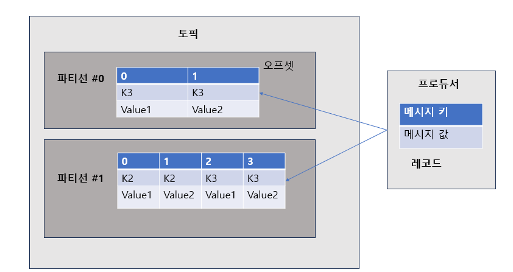
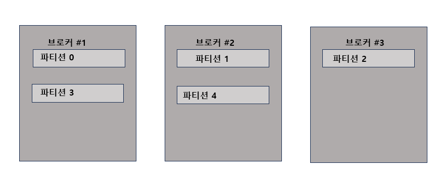
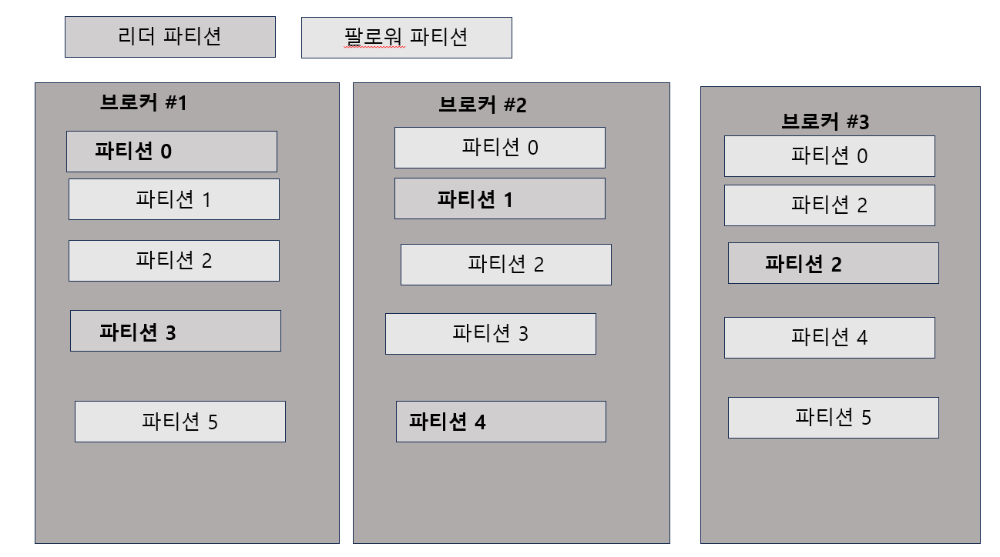

## 카프카 생태계

Apache Kafka는 분산 스트리밍 플랫폼으로, 대용량의 실시간 데이터를 안정적으로 처리하고 저장할 수 있는 시스템입니다. Kafka 생태계는 이러한 Kafka의 핵심 기능을 중심으로 다양한 도구와 라이브러리들이 결합되어 구성된 환경을 의미하며, 이를 통해 데이터 파이프라인, 실시간 스트림 처리, 이벤트 기반 아키텍처 등 다양한 용도의 시스템을 구축할 수 있습니다.

다음은 Kafka 생태계를 구성하는 주요 구성 요소들입니다:

### 1. 프로듀서 (Producer)

- **역할**:프로듀서는 데이터를 생성하여 Kafka 클러스터 내 특정 토픽(topic)에 메시지를 전송하는 역할을 합니다.
- **주요 특징**:
    - **메시지 전송**: 키-값 쌍의 메시지를 전송하며, 메시지의 파티셔닝을 통해 분산 저장 및 부하 분산을 지원합니다.
    - **전송 옵션**: 동기적/비동기적 전송, 전송 보증(acknowledgment) 등의 옵션을 통해 데이터의 안정적 전달을 보장합니다.
    - **확장성**: 여러 프로듀서를 통해 대용량 데이터의 병렬 처리가 가능하며, 다양한 클라이언트 라이브러리(Java, Python, C++ 등)를 이용해 손쉽게 통합할 수 있습니다.

---

### 2. Kafka Connect

- **역할**:Kafka Connect는 Kafka 클러스터와 외부 시스템 간의 데이터 이동을 자동화하는 프레임워크입니다.
- **주요 특징**:
    - **Source 커넥터**: 외부 데이터 소스(예: 데이터베이스, 로그 파일, 클라우드 서비스 등)에서 데이터를 추출하여 Kafka 토픽에 기록합니다.(프로듀서 역할)
    - **Sink 커넥터**: Kafka 토픽에 저장된 데이터를 외부 시스템(예: 데이터 웨어하우스, 검색 엔진,JDBC, Elasticsearch 등)으로 내보냅니다.(컨슈머 역할)
    - **플러그인 기반 확장성**: 다양한 커넥터를 플러그인 형태로 지원하여, 새로운 데이터 소스나 싱크를 쉽게 추가할 수 있습니다.
    - **운영 자동화**: 분산 환경에서의 데이터 이동을 간소화하고, 스케일 아웃 및 모니터링 기능을 제공합니다.

---

### 3. 카프카 클러스터 (Kafka Cluster)

- **역할**:Kafka 클러스터는 데이터의 중심 저장소이자 전송의 허브 역할을 하며, 여러 브로커(노드)로 구성된 분산 시스템입니다.
- **주요 특징**:
    - **분산 저장 및 처리**: 각 브로커는 토픽의 여러 파티션을 저장하며, 리더-팔로워 복제 구조를 통해 데이터의 고가용성과 내결함성을 유지합니다.
    - **확장성**: 필요에 따라 브로커를 추가하여 데이터 처리량과 저장 용량을 확장할 수 있습니다.
    - **실시간 스트리밍**: 대용량의 데이터 스트림을 안정적으로 처리하며, 메시지 순서 보장 및 빠른 읽기/쓰기 성능을 제공합니다.

---

### 4. Kafka Streams

- **역할**:Kafka Streams는 Kafka 토픽에 저장된 실시간 데이터를 처리하는 자바 기반의 라이브러리로, 애플리케이션 내부에서 스트림 처리 로직을 구현할 수 있도록 지원합니다.
- **주요 특징**:
    - **실시간 데이터 처리**: 스트림 필터링, 집계, 조인, 상태 저장 연산 등 복잡한 데이터 처리 작업을 손쉽게 구현할 수 있습니다.
    - **내장형 라이브러리**: 별도의 클러스터 구성 없이 애플리케이션 내에서 직접 실행되어, 기존 Kafka 클러스터와 자연스럽게 연동됩니다.
    - **상태 관리**: 내장 상태 저장소를 사용하여, 윈도우 연산이나 집계 등의 작업에서 상태를 유지하며, 장애 복구 기능도 지원합니다.

---

### 5. 컨슈머 (Consumer) 및 스트림즈 컨슈머

- **일반 Kafka Consumer**:
    - **역할**: Kafka 클러스터의 특정 토픽에 기록된 메시지를 구독(subscribe)하여 읽어들이고, 비즈니스 로직에 따라 데이터를 처리합니다.
    - **주요 특징**:
        - **파티션 병렬 처리**: 동일한 컨슈머 그룹 내에서 파티션 단위로 메시지를 병렬로 처리하여 높은 처리량을 달성합니다.
        - **오프셋 관리**: 처리한 메시지의 위치(오프셋)를 관리하여, 장애 발생 시 재처리나 복구가 가능하도록 합니다.
- **스트림즈 컨슈머**:
    - **역할**: Kafka Streams 애플리케이션 내부에서 처리된 결과 데이터를 소비하는 역할을 하거나, 외부 애플리케이션이 Kafka Streams 애플리케이션에서 생성한 토픽을 구독하는 형태로 사용됩니다.
    - **주요 특징**:
        - **실시간 분석 후속 처리**: Kafka Streams로 처리된 데이터를 기반으로 추가적인 실시간 분석, 모니터링 또는 후속 ETL 작업을 수행할 수 있습니다.
        - **통합 처리 파이프라인**: 스트림 처리와 일반 컨슈머의 역할이 결합되어, 실시간 처리와 결과 소비가 유기적으로 이루어집니다.
  
  
    

---
  
  
### 카프카 브로커 와 클러스터

Apache Kafka의 핵심 구성 요소 중 **브로커(Broker)**, **클러스터(Cluster)**, 그리고 **ZooKeeper**는 Kafka 시스템의 안정적 운영과 분산 환경 관리를 위해 중요한 역할을 합니다. 아래에서 각 요소에 대해 자세히 설명합니다.

---

## 1. ZooKeeper

- **정의 및 역할**:

  Apache ZooKeeper는 분산 시스템을 위한 중앙 집중형 코디네이션 서비스로, Kafka 클러스터의 메타데이터와 상태 정보를 관리합니다.

- **주요 기능**:
    - **메타데이터 관리**: Kafka 브로커, 토픽, 파티션, 리더 정보 등 클러스터의 전반적인 상태를 저장하고 관리합니다.
    - **분산 코디네이션**: 브로커의 등록, 리더 선출, 장애 감지 및 복구와 같은 클러스터 관리 작업을 수행합니다.
    - **동기화와 일관성 보장**: 분산 환경에서 여러 서버 간의 동기화를 지원하여, 일관된 상태를 유지할 수 있도록 합니다.
- **최신 동향**:
    - 과거 Kafka는 클러스터 관리와 메타데이터 관리를 위해 ZooKeeper에 의존했으나, 최근 버전에서는 자체 메타데이터 관리(KRaft 모드)를 도입하여 ZooKeeper 의존성을 점차 줄여가고 있습니다.

> 코디네이션(Coordination)"은 여러 구성 요소나 프로세스가 서로 협력하고 조율되어 하나의 통일된 시스템처럼 동작하도록 하는 과정을 의미합니다.
>  

---

## 2. Kafka 클러스터 (Cluster)

- **정의 및 역할**:

  Kafka 클러스터는 여러 Kafka 브로커가 모여 하나의 분산 시스템을 이루며, 데이터의 저장, 분산 처리 및 복제를 담당합니다.(기본적으로 3개의 브로커로 구성을 권장)

- **주요 기능**:
    - **데이터 분산 저장**: 토픽은 여러 파티션으로 나뉘며, 이 파티션들은 클러스터 내 여러 브로커에 분산되어 저장됩니다.
    - **데이터 복제 및 내결함성**: 각 파티션은 복제본을 통해 여러 브로커에 저장되어, 하나의 브로커에 장애가 발생해도 데이터 손실 없이 시스템이 계속 운영됩니다.
    - **부하 분산**: 생산자(Producer)와 소비자(Consumer)의 요청이 클러스터 내 여러 브로커에 분산되어 처리되므로, 전체 시스템의 부하를 효과적으로 분산할 수 있습니다.
- **운영 관리**:

  클러스터는 토픽 생성, 파티션 할당, 복제 설정, 브로커 상태 모니터링 등 다양한 운영 작업을 통해 안정적이고 확장 가능한 데이터 스트리밍 환경을 제공합니다.


---

## 3. Kafka 브로커 (Broker)

- **정의 및 역할**:

  Kafka 브로커는 Kafka 시스템 내에서 **개별 서버** 인스턴스로, **실제 메시지를 수신, 저장 및 전송**하는 역할을 담당합니다.

- **주요 기능**:
    - **메시지 저장**: 프로듀서가 전송한 메시지를 토픽과 파티션 단위로 저장합니다.
    - **메시지 전송**: 컨슈머가 요청할 때, 해당 파티션의 메시지를 읽어 전송합니다.
    - **데이터 복제 관리**: 각 파티션의 리더와 팔로워 역할을 수행하며, 데이터의 안정성과 내결함성을 보장합니다.
- **특징**:
    - **확장성**: 필요에 따라 브로커를 추가하여 시스템의 처리량과 저장 용량을 확장할 수 있습니다.
    - **분산 처리**: 여러 브로커가 협력하여 메시지를 분산 저장 및 처리하므로, 단일 장애 지점을 제거하고 고가용성을 유지합니다.

---

### 전체 시스템 관점

1. **ZooKeeper**는 Kafka 클러스터의 상태 및 메타데이터(브로커 정보, 토픽, 파티션, 리더 정보 등)를 중앙에서 관리하며, 클러스터의 안정적인 운영과 코디네이션을 지원합니다.
2. **Kafka 클러스터**는 여러 브로커로 구성되어 데이터를 분산 저장, 복제, 부하 분산 및 내결함성을 구현함으로써 대용량 데이터 스트리밍 환경을 효과적으로 운영합니다.
3. **Kafka 브로커**는 실제 데이터의 수신, 저장 및 전송을 담당하여, 프로듀서와 컨슈머 간의 메시지 전달을 책임집니다.

### 상호 연계 및 전체 시스템 관점

1. **데이터 생산 및 저장**:
    - **프로듀서**가 생성한 메시지는 Kafka 브로커에 전송되어 저장되며, 이 메시지는 클러스터 내의 여러 브로커에 분산되어 보관됩니다.
2. **분산 운영 관리**:
    - **Kafka 클러스터**는 다수의 브로커가 협력하여 데이터 분산 저장, 부하 분산, 복제 및 장애 복구를 수행함으로써, 대용량 데이터 스트리밍 환경에서도 안정적인 운영을 보장합니다.
3. **메타데이터와 클러스터 상태 관리**:
    - **ZooKeeper**는 Kafka 클러스터의 메타데이터(브로커, 토픽, 파티션, 리더 등)를 관리하고, 클러스터 내에서 발생하는 변화(예: 브로커 추가/제거, 장애 감지 등)를 코디네이트하여 시스템 전체의 일관성을 유지합니다.

## **요약 표: 구성 요소 비교**

| **구성 요소** | **주요 기능** | **의존성 변화** |
| --- | --- | --- |
| 브로커 | 데이터 저장/처리, 파티션 관리 | KRaft로 전환 중 |
| 클러스터 | 브로커 집합, 확장성/내결함성 제공 | 독립적 운영 가능 |
| 주키퍼 (레거시) | 메타데이터 관리, 컨트롤러 선출 | Kafka 3.0+에서 제거 |
| KRaft | Raft 기반 메타데이터 관리 | 주키퍼 대체 |
  


  

---  
  

### 여러개의 카프카 클러스터가 연결된 주키퍼

```

                          +---------------------+
                          |     ZooKeeper       |
                          |  (Central Service)  |
                          +---------------------+
                                   / | \
                                  /  |  \
                                 /   |   \
                                /    |    \
              +----------------+   +----------------+   +----------------+
              | Kafka Cluster 1|   | Kafka Cluster 2|   | Kafka Cluster 3|
              +----------------+   +----------------+   +----------------+
              |  Broker 1      |   |  Broker 1      |   |  Broker 1      |
              |  Broker 2      |   |  Broker 2      |   |  Broker 2      |
              |  Broker 3      |   |  Broker 3      |   |  Broker 3      |
              +----------------+   +----------------+   +----------------+

```
  
- 카프카 클러스터를 실행하기 위해서는 주키퍼가 필요함
- 주키퍼의 서로 다른 `znode`에 클러스터를 지정하면 됨
- `root znode`에 각 클러스터별 `znode`를 생성하고 클러스터 실행시 `root`가 아닌 하위 `znode`로 설정
- 카프카 3.0 부터는 주키퍼가 없어도 클러스 동작 가능

> **znode**는 ZooKeeper의 기본 데이터 저장 단위로, 파일 시스템의 디렉터리나 파일과 유사한 개념입니다. ZooKeeper는 계층적(트리 형태) 네임스페이스를 제공하는데, 이 트리의 각 "노드"가 바로 **znode**입니다.
>
> 
  
  
## 브로커의 역할
  
## 컨트롤러
  
클러스터의 다수 브로커 중 한 대가 컨트롤러의 역할을 한다. 컨트롤러는 다른 브로커들의 상태를 체크 및 브로커가 클러스터에서 빠지는경우 해당 브로커에 존재하는 리더 파티션을 재 분배한다.  
  
카프카는 지속적으로 데이터를 처리해야 하므로 브로커의 상태가 비정상이라면 빠르게 클러스터에서 빼내는 것이 중요하다. 이 역 컨트롤러 역할을 하는 브로커에 장애가 생기면 다른 브로커가 해당 엄무를 대체한다.
  
> **리더 파티션**(Leader Partition)은 분산 메시징 시스템(예, Apache Kafka)에서 각 파티션에 할당된 하나의 주체를 의미합니다.  
> 즉, 하나의 토픽이 여러 개의 파티션으로 나뉘어 저장될 때, 각 파티션은 여러 복제본(레플리카)을 가질 수 있는데 그 중 읽기/쓰기 요청을 직접 처리하는 브로커가 바로 리더 파티션입니다.  

---  
  
### 데이터 삭제
  
카프카는 다른 메시징 플랫폼과 다르게 컨슈머가 데이터를 가져가더라도 토픽의 데이터가 삭제되지 않는다. 또한 프로듀서가 데이터 삭제 요청을 할수도 없다.  
   
오직 브로커만이 데이터를 삭제할 수 있다. **데이터 삭제는 파일 단위**로 이루어지는데 이 단위를 `로그 세그먼트`라고 부른다.  
  
이 세그먼트에는 다수의 데이터가 들어 있기 때문에 일반적으로 **데이터베이스처럼 특정 데이터를 선별해서 삭제할 수 없다.**
  
> **delete 옵션**으로  특정 시간, 용량 에따라 데이터를 삭제할 수 있다. 혹은 `compact`옵션을 사용하게 되면 가장 최신의 메세지 레코드를 제외하고 모두 삭제할 수 있다.
  
  

---
  
### 컨슈머 오프셋 저장
  
컨슈머 그룹은 토픽이 특정 파티션으로부터 데이터를 가져가서 처리하고 이 파티션의 어느 레코드까지 가져갔는지 확인하기 위해 오프셋을 커밋한다.  
  
즉 컨슈머가 카프카의 파티션의 어느 데이터 레코드까지 데이터를 처리했는지를 그 특정 위치를 알 수 있게 해주는 것을 커밋이라고 한다.
  
커밋한 오프셋은 __consumer_offsets 토픽에 저장한다. 여기에 저장된 오프셋틀 토대로 컨슈머 그룹은 다음 레코드를 가져가서 처리한다.
  
> **오프셋**(offset)은 Kafka에서 각 파티션 내에 저장된 레코드의 순차적인 위치를 나타내는 숫자입니다. 쉽게 말해, 파티션에 기록된 메시지들이 배열된 인덱스와 같은 역할을 합니다.
  
  

---  

### 그룹 코디네이터
그룹 코디네이터는 컨슈머 그룹의 상태를 체크하고 파티션을 컨슈머와 매칭되도록 분배하는 역할을 한다.  
  
컨슈머가 건슈머 그룹에서 빠지면 매칭되지 않은 파티션을 정상 동장하는 컨슈머로 할당하여 **끊임없이 데이터가 처리되도록 도와준다.**  
  
파티션을 컨슈머로 **재할당하는 과정**을 **리밸런스**(rebalance)라고 부른다.

## 데이터 저장

카프카를 실행할 때 config/server.properties의 **log.dir 옵션**에 정의한 디렉토리 위치에 데이터를 저장한다. **토픽 이름**과 **파티션 번호의 조합**으로 **하위 디렉토리를 생성**하여 데이터를 저장한다.

hello.kafka 토픽의 0번 파티션에 존재하는 데이터를 확인할 수 있다. **. log**에는 메시지와 메타데이터를 저장하고 **.index**는 메시지의 오프셋을 인덱싱한 정보를 담는 파일이다. **. timeindex** 파일에는 메시지에 포함된 timestamp값을 기준으로 인덱싱한 정보가 담겨있다.

이 메시지란 프로듀서에서 보낸 레코드 ,즉 **하나의 데이터를 메시지**라고 부르고 공식적으로 카프카에서는 이를 **레코드**라고 부른다

```scss
ls/target/kafka-logs
__consumer_offset-0   __consumer_offset-21

........
ls/target/kafka-logs/hello.kafka-0
00000000000.index      00000000000.log
00000000000.timeindex  leader-epoch-checkpoint
```

> **인덱싱(index)한 정보**가 담겨있다는 말은 **메시지 데이터가 저장된 로그 파일 내에서 특정 기준(예: 오프셋, 타임스탬프)을 사용하여 메시지의 물리적 위치(파일 내 바이트 오프셋)를 미리 매핑(mapping)해 놓은 정보**가 저장된 파일을 의미합니다.


### 로그와 세그먼트

```scss
ls/target/kafka-logs/hello.kafka-0
00000000000.log
00000000010.log
00000000020.log
```

카프카는 데이터가 특정 하나의 파일에 연속적으로 데이터가 저장되는 것이 아닌 위에 처럼 여러 파일에 나누어서 저장한다는 특징이 있다.

이렇게 나뉘는 기준은 크게 2가지가 있다. 하나는 바이트단위 이고 하나는 시간단위 이다.

- log.segment.byte : 바이트 단위의 최대 세그먼트 크기 지정. 기본 값은 1GB
- log.roll.ms(hours): 세기먼트가 신규 생성된 이후 다음 파일로 넘어가는 시간 주기. 기본 값은 7

위에 로그 파일을 보면 00.log, 10.log  20.log 라고 적혀 있다. 이 숫자는 오프셋 번호를 나타낸다.

이 오프셋은 레코드의 고유한 번호를 의미한다. 프로듀서가 레코드를 만들어서 브로커로 보내게 되면 파티션중 하나에 데이터가 저장된다 여기서는 **hello.kafka-0(0번 파티션)** 에 데이터가 저장될때 고유

한 번호(숫자)가 새롭게 지정되어서 저장된다.

즉 00.log 에는 0~9번까지의 레코드가, 10.log 에는 10~19 번까지의 레코드가 20.log에는 20~ 이런식으로 레코드가 저장되게 된다.

지금 상황에서 프로듀서에서 새롭게 레코드를 브로커에 전달하게 되면 가장 최신의 세그먼트인 20.log 에 데이터가 저장된다. 이때 가징 최신의 세그먼트, 즉 현재 쓰기가 진행되고 있는 세그먼트를  **active 세그먼트**라고 한다.

이때 우리는 파일명에서 해당 세그먼트를 추정할 수 있다. 세그먼트에 쓰여지는 **최초의 오프셋번호**가 파일명이 된다.

그래서 세그먼트 마다 지정된 바이트만큼 저장하고 다음 세그먼트로 넘어갈 수도 있고 기간이 지나서 다음 세거먼트로 넘어갈 수도 있다.

가장 마지막 세그먼트 파일(쓰기가 일어나고 있는 파일)을 엑티브 세그먼트라고 하고 이 세그먼트는 브로커의 삭제 대상에서 포함되지 않는다. 그 외에 다른 세그먼트는 retention 옵션에 따라 삭제 대상으로 지정할 수 있다.

> **Retention 옵션은** Kafka 브로커가 저장한 로그(세그먼트 파일)에서 **불필요하거나 오래된 데이터를 자동으로 삭제하기 위한 정책**을 의미합니다.

---

## 세그먼트와 삭제 주기

```java

ls/target/kafka-logs/hello.kafka-0
00000000000.log
00000000010.log
00000000020.log

```

### 1.cleanup.policy=delete

- retention.ms(minutes, hours): 세그먼트를 보유할 최대 기간. 기본 값은 7일
  - 하루에 들어오는 데이터의 양 과 브로커가 메세지를 저장하는 디스크의 용량을 생각해서 해당 값을 설정해야 한다. (일반적으로 3일로 설정한다.)
- retention.bytes: 파티션당 로그 적재 바이트 값. 기본 값은 -1 (지정하지 않음)
- log.retention.check.interval.ms: **세그머트가 삭제 영역에 들어왔는지 확인하는 간격**. 기본 값은 5분.

카프카에서 데이터는 파일단위, 즉 세그먼트 단위로 삭제가 발생하기 때문에 각 레코드 개별로 삭제 및 변경(로그(레코드)의 메시지 키, 오프셋. 헤더등)은 불가능하다. 때문에 데이터를 적재할 떄 프로듀서 또는 컨슈머에서 데이터를 검증하는 것이 좋다.

---

### 2. cleanup.policy=compact

```java
offsset        10, 11, 12, 13, 14, .....19          
-------
key            K1, K2, K1, K3, K3 .......K5
-------
value          val,val,val, val,val ..... val
```

토픽 압축 정책은 일반적으로 생각하는 zip과 같은 압축과는 다른 개념이다. 여기서 말하는 압축이란 메시지 키 별로 해당 메시지 키의 레코드 중 **오래된 데이터를 삭제하는 정책**이다.(즉 가장 최근의 메시지 키만 남기고 삭제하는 정책)

예를 들어 위에 14번의 K3, 12번 K1이 가장 최신의 데이터이다. 여기서 해당 레코드를 제외한 레코드가 삭제 되게 된다. 이처럼 특정 메시지 키 단위로 가장 최신 메시지 키를 제외한 레코드를 삭제한다.

그렇기 때문에 삭제 정책과 다르게 **일부 레코드만 삭제**가 될 수 있다. 압축은 **엑티브 세그먼트를 제외**한 데이터가 대상이다.

이 압축이 실행될 때 영역 별로 다르게 수행된다.

- **테일 영역**: 압축 **정책에 의해 압축이 완료된 레코드**들. 클린(clean)로그 라고 부른다. 중복 메시지 키가 없다.
- **헤드 영역**: **압축 정책이 되기 전 레코드들**. 더티(dirty)로그 라고 부란드. 중복 메시지 키가 있다.

### min.cleanable.dirty.ratio

데이터의 **압축 시작 시점에 대한 옵셥**이다. 해당 옵션은 액티브 세그먼트를 제외한 세그먼트에 남아 있는 **테일영역의 레코드 개수와 헤드 영역의 레코드 개수의 비율**을 뜻한다.

예를 들어 0.5로 설정하면 테일 영역의 레코드 개수가 헤드 영역의 레코드 개수와 동일할 경우 압축이 실행된다. 0.9와 같이 크게 설정하면 한번에 압축을 할 때 많은 데이터가 줄어들므로 압축 효과가 좋다.

그러나 0.9비율이 될 때 까지 용량을 차지하므로 용량 호율이 좋지 못하고 반대로 0.1과 같이 너무 작게 설정하면 너무 자주 압축(가장 최신의 메시지만 유지)이 일어나서 브로커에 부담을 줄 수 있다.

### 왜 카프카는 이런식으로 데이터를 삭제할까?

Kafka에서 **cleanup.policy=compact** 설정은 단순히 데이터를 압축(zip)하는 것이 아니라, **메시지 키별로 가장 최신의 상태(state)만 보존**하기 위한 전략입니다. 왜 이러한 방식으로 데이터를 삭제하냐면, Kafka가 단순한 메시지 큐가 아니라 **분산 로그** 및 **상태 저장** 용도로 사용되기 때문입니다.

## 1. 상태 복원(State Recovery) 지원

- **최신 상태 보존**:
  로그 컴팩션은 각 메시지 키에 대해 가장 최근의 업데이트만 남기므로, 소비자(특히 Kafka Streams 애플리케이션)는 이 로그를 통해 쉽게 최신 상태를 복원할 수 있습니다.
  예를 들어, 키가 사용자 ID라면, 로그 컴팩션을 통해 각 사용자의 마지막 상태(예: 최종 프로필 정보)만 남게 되어, 장애 복구나 재처리 시에 전체 상태를 빠르게 재구성할 수 있습니다.

---

## 2. 디스크 사용 최적화

- **중복 데이터 제거**:
  동일한 키에 대한 과거의 변경 기록은 상태 재구성을 위해 필요하지 않으므로, 이를 삭제함으로써 저장 공간을 효율적으로 사용할 수 있습니다.
- **오래된 데이터 삭제**:
  활성(active) 세그먼트를 제외한 비활성 세그먼트에서만 컴팩션이 진행되므로, 지속적으로 추가되는 신규 데이터에는 영향을 주지 않으면서, 오래된 중복 데이터만 정리합니다.

---

## 3. 데이터 일관성과 성능 향상

- **불변 로그(Immutable Log)**:
  Kafka는 기본적으로 변경 불가능한(immutable) 로그를 사용합니다. 로그 컴팩션은 이 불변 로그의 특성을 유지하면서도, 불필요한 중복 기록을 제거해 최종 상태만 남깁니다.
- **비동기 백그라운드 처리**:
  컴팩션 작업은 백그라운드에서 비동기적으로 수행되어, 실시간 데이터 수집에 영향을 주지 않습니다.

---

## 4. 이벤트 소싱 및 상태 저장 애플리케이션 지원

- **이벤트 소싱(Event Sourcing)**:
  많은 시스템에서 이벤트 소싱 패턴을 사용할 때, 전체 이벤트 기록은 중요하지만, 최종 상태만 필요할 경우가 많습니다. 로그 컴팩션은 이러한 요구사항에 맞춰, 각 엔터티의 최신 상태만을 보존합니다.
- **상태 저장 애플리케이션**:
  Kafka Streams, ksqlDB 등 상태 기반 애플리케이션은 로그 컴팩션 덕분에, 전체 이력을 다시 처리하지 않고도 최신 상태만을 읽어 들여 복원할 수 있습니다.
  
  
---

### 복제(Replication)

데이터 복제는 **카프카를 장애 허용 시스템(fault tolerant system)으로 동작하도록 하는 원동력**이다.

복제 이유는 클러스터로 묶인 브로커 중 일부에 장애가 발생하더라도 **데이터를 유실하지 않고** 안전하게 사용하기 위함이다.

이 데이터 복제는 파티션 단위로 이루어진다. 토픽을 생성할때 파티션의 개수도 같이 설정되는데 직접 오션을 설정하지 않으면 브로커에 설정된 옵션 값을 따라간다.

복제의 최솟값은 1(복제없음)이고 최대값은 브로커 개수만큼 설정하여 사용할 수 있다.

복제된 파티션은 리더와 팔로워로 구성된다. 컨슈머 혹은 프로듀서와 직접 통신하는 파티션을 리더, 나머지 복제 데이터를 가지고 있는 파티션을 팔로워라고 부른다.

팔로워 파티션은 리더 파티션의 **오프셋을 확인하**여 현재 자신이 가지고 있는 **오프셋과 차이**가 나는 경우 리더 파티션으로 부터 데이터를 가져와서 자신의 파티션에 정하는데, 이 과정을 복제라고 부른다.

파티션 복제로 인해 나머지 브로커에도 파티션의 데이터가 복제되므로 복제 개수 만큼의 저장 용량이 증가한다는 단점이 있다.

그러나 **복제를 통해 데이터를 안전하게 사용할 수 있다는 강력한 장점때문에 카프카를 운영할 때는 2 이상의 복제 개수를 정하는 것이 중요하다.**

카프카 브로커가 설치된 기업용 서버는 개인용 컴퓨터 보다 안정성이 좋지만 해커로 인한 칩입, 디스크 오류, 네트워크 연결 장애등의 이유로 언제든 장애가 발생할 수 있다.

브로커가 다운되면 해당 **브로커에 있는 리더 파티션은 사용할 수 없기때문**에 **팔로우 파티션 중 하나가 리더 파티션으로 승격**되고 이를 통해 데이터를 유실되지 않고 컨슈머나 프로듀서와 데이터를 주고받도록 동작할 수 있다.(절대 팔로우 파티션과 통신 하지 않는다)

운영시 데이터의 종류 및 상황에 따라 복제 개수, 토픽별 복제 개수를 다르게 설정하여 운영하기도 한다. 1 또는 2로 설정해서 운영하고 금융 정보와 같이 유실이 일어나면 안되는 데이터의 경우 복제 개수를 3으로 설정하기도 한다.
  
---

### ISR(In-Sync-Replicas)

ISR은 리더 파티션과 팔로워 파티션이 모두 싱크가 된 상태를 뜻한다.

이때 **싱크가 된 상태**란 **리더 파티션과 팔로워 파티션의 오프셋의 크기가 동일**하다는 의미이다.

복제 개수가 2인 토픽을 예를 들어보면, 토픽에 리더 파티션 1개와 팔로워 파티션 1개가 존재할때 리더 파티션에 0부터 3의 오프셋이 있다고 가정한다. 이때 팔로워 파티션에 동기화가 완료되면 0부터 3 까지 오프셋이 존재 해야한다.

동기화가 완료 됐다는 의미는 리더 파티션의 모든 데이터가 팔로워 파티션에 복제가된 생태를 말하기 때문이다.

만약 리더 파티션의 데이터를 모두 복제하지 못한 상태이고, 싱크가 되지 않은 팔로워 파티션이 리더 파티션으로 승격되게 되면 데이터 유실이 될 수 있다. 유실이 발생하더라도 서비스를 중단하지 않고 지속적으로 토픽을 사용하고 싶다면 ISR이 아닌 팔로워 파티션을 리더로 선출하도록 설정할 수 있다.

- unclean.leader.election.enable=true
  - 유실을 감수함. 복제가 안된 팔로워 파티션을 리더로 승급
- unclean.leader.election.enable=false
  - 유실을 감수하지 않음. 해당 브로커가 복구될 때까지 중단.
  
  

---

## 토픽 과 파티션

토픽은 카프카에서 **데이터를 구분하기 위해 사용하는 단위**이다. 이때 토픽은 1개 이상의 파티션을 소유하고 있고 파티션에는 **프로듀서가 보낸 데이터**들이 저장되는데 **이 데이터를 레코드(record)** 라고 부른다.

파티션은 자료구조 큐와 비슷한 구조라고 생각하면 이해하기 쉽다. FIFO(First In First Out)  구조와 같이 먼저 들어간 레코드는 컨슈머가 먼저 가져가게 된다. 일반적인 큐의 경우 데이터를 가져가게되면(pop) 데이터가 삭제되지만 카프카에서는 삭제되지 않는다. 즉 파티션의 레코드는 컨슈머가 가져가는 것과 별개로 관리된다.

이러한 특징 때문에 토픽의 레코드는 다양한 목적을 가진 여러 컨슈머 그룹들이 토픽의 데이터를 여러번 가져갈 수 있다.  


  
  
---

### 토픽 생성시 파티션이 배치되는 방법

  

파티션이 5개인 토픽을 생성했을 경우 0번 브로커 부터 시작하여 **round-robin 방식으로 리더 파티션들이 생성된다.** 카프카 클라이언트는 리더 파티션이 있는 브로커와 통신하여 데이터를 주고 받으므로 여러 브로커에 골고루 네트워크 통신을 하게된다.

이를 통해, 데이터가 특정 서버(여기서 브로커)와 통신이 집중되는(host spot)형상을 막고 선형 확장(linear scale out)을 하여 데이터가 많아지더라도 자연스럽게 대응 할 수 있게 된다.

---

### **Round-robin 방식**

**Round-robin 방식**은 파티션이나 작업들을 여러 대상(여기서는 브로커)에 **순차적으로 분배**하는 알고리즘입니다. 예를 들어, 파티션이 5개 있고 브로커가 여러 대 있다면, 첫 번째 파티션은 0번 브로커에, 두 번째 파티션은 그 다음 브로커에, 이런 식으로 순서대로 할당되어, 모든 브로커에 골고루 분산되도록 합니다.

---

### 선형 확장(Linear Scale-Out)과 Host Spot 방지

- **Host Spot 방지**
  - **Host Spot**은 네트워크나 시스템 자원이 한 서버(브로커)에 집중되어, 그 서버가 과부하되거나 병목현상이 발생하는 현상을 의미합니다.
  - Round-robin 방식으로 파티션 리더를 여러 브로커에 분산시키면, 클라이언트가 데이터를 주고받을 때 특정 브로커에 요청이 집중되지 않고 모든 브로커로 고르게 분산됩니다.
  - 이를 통해 한 브로커에 과도한 부하가 걸리는 상황(Host Spot 현상)을 방지할 수 있습니다.
- **선형 확장(Linear Scale-Out)**
  - **선형 확장**이란, 시스템에 브로커(서버)를 추가할 때 전체 처리 능력이 추가된 서버 수에 비례해서 증가하는 것을 의미합니다.
  - Round-robin 방식 덕분에 파티션 리더가 여러 브로커에 골고루 배분되면, 새로운 브로커를 추가할 때 기존의 부하 분산 메커니즘이 그대로 적용됩니다.
  - 결과적으로, 클러스터에 브로커를 추가하면 네트워크 통신이나 데이터 처리 부하가 균등하게 분산되어, 시스템 전체 성능이 선형적으로 증가하게 됩니다.
  
  

---
  
### 토픽 생성시 파티션이 배치되는 방법

  

Kafka는 토픽 생성 시 각 리더 파티션 과 팔로워(복제본) 파티션을 클러스터의 브로커에 균등하게 분산하도록 할당합니다. 기본적으로는 다음과 같은 방식으로 동작합니다.

- **리더 파티션 할당**:

  토픽의 각 파티션에 대해 리더는 round-robin 방식으로 여러 브로커에 순서대로 배분됩니다. 즉, 첫 번째 파티션의 리더는 0번 브로커, 두 번째는 1번 브로커, ... 이런 식으로 할당되어 클러스터 전체에 고르게 분산됩니다.

- **팔로워(복제본) 할당**:

  각 파티션의 복제본(팔로워)은 리더와는 다른 브로커에 순환(rotate) 방식으로 할당됩니다.

  예를 들어, 리더가 0번 브로커에 있다면 첫 번째 팔로워는 1번 브로커, 그 다음은 2번 브로커 등으로 할당될 가능성이 높습니다.
  
### 특정 브로커에 파티션이 쏠린 형상
특정 브로커에 파티션이 몰리는 경우에는 kafka-reassign-partition.sh 명령으로 파티션을 재분배 할 수 있다.

### 파티션 개수와 컨슈머 개수의 처리량

파티션은 카프카의 병렬 처리의 핵심으로써 그룹으로 묶인 컨슈머들이 레코드를 별렬로 처리 할 수 있도록 매칭된다.

컨슈머의 처리량이 한정된 상황에서 많은 레코드를 병렬로 처리하는 가장 좋은 방법은 컨슈머의 개수를 늘려 스케일 아웃하는 것이다. 컨슈머 개수를 늘림과 동시에 파티션의 개수도 늘리면 처리량이 증가한다.

Kafka에서는 각 파티션마다 반드시 하나의 리더가 존재하고, 같은 컨슈머 그룹 내에서는 파티션 당 하나의 컨슈머에게만 할당됩니다. 즉, 하나의 토픽에 파티션이 1개라면 그 파티션의 리더만 존재하고, 결과적으로 해당 파티션은 한 컨슈머에게만 할당되어 병렬 처리가 제한됩니다.

반대로 토픽에 파티션이 여러 개라면, 각 파티션은 각기 다른 리더(또는 팔로워 중 하나가 리더 역할)로 존재하므로, 여러 컨슈머가 병렬로 할당받아 처리할 수 있습니다.

따라서 병렬 처리를 극대화하려면 토픽의 파티션 개수를 늘리는 것이 필수적입니다.

**요약:**

- **파티션 1개**: 한 컨슈머에게만 할당 → 병렬 처리 제한.
- **파티션 여러 개**: 각 파티션(리더)이 별도로 할당됨 → 여러 컨슈머가 병렬 처리 가능.

이렇게 리더 파티션이 여러 개일 때만 여러 컨슈머와 매핑되어 병렬 처리가 효과적으로 이루어집니다.

만약 컨슈머에서 장애가 발생하는 경우에 다른 컨슈머에서 여러 파티션의 데이터를 처리할 수도 있다.

### 핵심 포인트

- **리더 파티션**:

  토픽에 파티션 수가 5개라면, 5개의 리더 파티션이 각각 생성됩니다. 이 리더 파티션은 각 파티션에 대해 클라이언트와 직접 통신하는 역할을 합니다.

- **팔로워(복제본) 파티션**:

  각 파티션은 **복제 인수(replication factor)** 값에 따라 추가 복제본(팔로워)을 가집니다.

  예를 들어, 복제 인수가 3이라면, 각 파티션은 1개의 리더와 2개의 팔로워를 가지게 됩니다.

  여기서 팔로워 파티션이 생성될 브로커는 클러스터 내 여러 브로커에 균등하게 분산되도록 Kafka 내부 알고리즘에 의해 결정되며, 반드시 브로커 수와 일치하지는 않습니다.


### 정리

- 토픽에 파티션이 5개이면, 5개의 리더 파티션이 존재합니다.
- 팔로워 파티션의 수는 복제 인수에 따라 결정됩니다.
  - 예를 들어, 복제 인수가 3이면 각 파티션마다 1 리더 + 2 팔로워, 즉 총 5개의 파티션마다 3개의 복제본이 생성됩니다.
- 브로커 수가 많더라도 복제 인수가 낮으면 모든 브로커에 팔로워 파티션이 분산되는 것이 아니라, 설정된 복제 인수에 따라 일부 브로커에만 할당됩니다.

따라서, 병렬 처리는 토픽의 파티션 수에 의해 결정되며, 복제 인수는 내결함성과 데이터 가용성을 위한 설정입니다.
  
---

### 파티션 개수를 줄이는 것은 불가능

카프카에서 파티션 개수를 줄이는 것은 지원하지 않는다. 그러므로 파티션을 늘리는 작업을 할 때는 신중히 파티션 개수를 정해야한다.

한번 늘리면 줄이는 것은 불가능하기 때문에 토픽을 삭제하고 재 생성하는 방법 외에는 없기 때문이다. 카프카에서는 파티션의 데이터를 세그먼트로 저장하고 있으며 만에 하나 지원을 한다고 하더라도 여러 브로커에 저장된 데이터를 취합하고 정렬해야하는 복잡한 과정을 거쳐야 하기 때문에 클러스터에 큰 영향이 가게 된다.

  

---


## **레코드(Record)**

```

+--------------------------+
|        Record            |
+------------+-------------+
| timestamp  | 타임스탬프   |
+------------+-------------+
| offset     | 오프셋       |
+------------+-------------+
| headers    | 헤더         |
+------------+-------------+
| key        | 메시지 키    |
+------------+-------------+
| value      | 메시지 값    |
+------------+-------------+

```

레코드는 타임스탬프, 헤더, 메시지 값, 오프셋으로 구성되어 있다. 프로듀서가 생성한 레코드가 브로커로 전송되면 오프셋과 타임스틈패가 지정되어 저장된다. **브로커에 한번 적재된 레코드는 수정할 수 없고** 로그 리텐션 기간 또는 용량에 따라서만 삭제된다.

---

## **각 구성 요소 상세 설명**

| 항목 | 설명 | 역할 |
| --- | --- | --- |
| **timestamp** | 메시지의 **생성 시간**을 나타내는 정보입니다. 
일반적으로 Unix Timestamp 형식을 사용합니다. | 메시지가 생성된 시간 추적 |
| **offset** | **메시지 위치를 나타내는 고유한 숫자값**으로, 레코드가 저장된 파티션에서 메시지의 위치를 의미합니다. | 메시지 처리 위치 관리, 순서 유지 |
| **headers** | 메시지에 부가적으로 전달되는 **메타데이터**입니다. 
 키-값 쌍의 집합 형태로 구성됩니다. | 추가적인 정보 전달, 메시지 라우팅 및 필터링 등 |
| **key** | 메시지의 **식별자 역할**을 하는 키입니다. 
 메시지 파티셔닝(partitioning)을 결정할 때 사용합니다. | 메시지 분류, 특정 파티션 지정 |
| **value** | 레코드의 실제 데이터로, 전달하고자 하는 메시지의 본문(Body)입니다. 
 JSON, XML, 이진(Binary) 데이터 등 다양한 형태를 가질 수 있습니다. | 메시지의 핵심 데이터 저장 |

---

### 레코드- 타임스탬프

레코드의 타임스탬프는 스트림 프로세싱에서 활용하기 위한 **시간을 저장하는 용도**로 사용된다. 카프카 0.10.0.0 이후 버전부터 추가된 타임스탬프는 Unix timestamp가 포함되며 프로듀서에서 따로 설정하지 않으면 기본 값으로 ProducerReodrd 생성 시간(CreatTime)이 들어간다.

브로커 적재 시간(LogAppendTime)으로 설정할 수도 있다. 해당 옵션은 토픽 단위로 설정 가능(message.timestamp.type)

---

### 레코드- 오프셋

오프셋은 **프로듀서가 생성한 레코드에 존재하지 않는다.** 브로커에 적재될 때 오프셋이 저장된다. 오프셋은 0 부터 시작되서 1씩 증가된다.

컨슈머는 오프셋을 기반으로 처리가 완료된 데이터와 앞으로 처리해야할 데이터를 구분하고 각 메시지는 **파티션별로 고유한 오프셋**을 가지므로 **컨슈머에서 중복 처리를 방지**하기 위한 목적으로도 사용된다.

---

### 레코드- 헤더

헤더는0.11 부터 제공된 기능으로 Key/Value 데이터를 추가할 수 있으며 레코드의 스키마 버전이나 포멧과 같이 데이터 **프로세싱에 참고**할만한 정보를 담아 사용

---

### 레코드- 키

메시지 키는 처리하고자 하는 **메시지 값을 분류하기 위한 용도**로 사용되며, 이를 **파티셔닝**이라고 부른다.

파티셔닝에 사용하는 메시지 키는 **파티셔너**(Partitioner)에 따라 토픽의 파티션 번호가 정해진다. 메시지 키는 필수 값이 아니며, 지정하지 않으면 null로 설정되고 **메시지키가 null**인 레코드는 특정 토픽의 파티션에 라운드 로빈으로 전달된다.

**null이 아닌 키**는 해쉬값에 의해서 특정 파티션에 매핑되어 전달된다.(기본 파티셔너의 경우)

- **파티셔너?**

  Kafka의 파티셔너(Partitioner)는 프로듀서가 메시지를 전송할 때, 메시지가 **어떤 파티션(Partition)에 저장될지 결정하는 컴포넌트**입니다.

  Kafka는 하나의 토픽(topic)을 여러 파티션으로 나누어 메시지를 저장하는데, 이때 파티셔너가 메시지를 분산하여 저장할 파티션을 결정하는 로직을 수행합니다.


---

### 레코드- 메시지값

레코드의 값은 실질적으로 처리할 데이터가 담긴다. 이 값의 포맷은 제네릭으로 사용자에 의해 저장된다. Float, Byte[], String 등 다양한 형태로 저장 가능하며 필요에 따라 사용자 지정 포맷으로 직렬화/역직렬화 클래스를 만들어 사용할 수도 있다. 브로커에 저장된 메시지 값은 어떤 포맷으로 직렬화 되어 저장되었는지 알 수 없기 때문에 컨슈머는 미리 역직렬화 포맷을 알고 있어야 한다.
  

---

## 토픽 이름

### 제약 조건

- 빈 문자열 토픽이름은 지원하지 않는다.
- 마침표 하나(.) 또는 둘(..)로 생성될 수 없다.
- 이름의 길이는 249자 미만으로 새성되어야 한다.
- 영어 대, 소문자와 숫자 0부터 9 그리고 마침표(.), 언더바(_) 하이픈(-) 조합으로 생성할 수 있다. 이외의 문자열이 포함된 토픽 이름은 생성 불가하다.
- 카프카는 내부 로직 관리 목적으로 사용되는 2개 토픽(__consumer_offsets, __transaction_state)과 동일한 이름으로 생성 불가능하다.
- 카프카 내부적으로 사용하는 로직 때문에 토픽에 마침표(.)와 언더바(_)가 동시에 들어가면 안된다.
  - 생성은 할 수 있지만 사용시 이슈가 발생할 수 있기 때문에 이 둘을 같이 사용하면 WARING 메시지가 발생한다.

### 작명 방법

**토픽의 이름은 데이터의 얼굴** 토픽 이름을 모호하게 작성하면 **유지보수 시 큰 어려움**을 겪을 수 있다.

예를들어 t**est-20210204, abc, bigdata, test**등 어떤 용도로 누가 사용하고 있는지, 어떻게 만들어 졌는지 알 수 없으므로 **지양**해야한다.  중요 한 것은 토픽 이름에 대한 규칙을 사전에 정의하고 구성원들해당 규칙을 준수해서 명명하는 것이다.

아무리 규칙을 정해도 따르지 않으면 예측하지 못한 방향으로 토픽 이름이 생성될 것이고 이것들은 기술 부채(technical debt)로 남아 카프카 운영자의 머리를 아프게 할 것이다.

또한 카프카 토픽은 한번 생성되면 이름을 변경하기 위해서는 다시 삭제 후 다시 생성하는 방법 것 외에는 방법이 없다. 따라서 카프카 클러스터 사용자에게 토픽 생성에 대한 규칙을 인지 시키고 규칙에 따르도록 하는것이 중요하다.

규칙을 따르지 않은 토픽 이름의 경우 주기적으로 확인하고 검토하여 사용 여부를 판단해야 한다. 단발성 으로 생성된 토픽이라면 삭제하고 실제 사용하는 토픽이라면 삭제 후 신규 토픽을 만드는 것을 권장한다.

### 토픽 작명의 템플릿과 예시

- <환경>.<팀-명>.<애플리케이션-명>.<메시지-타입>
  - prd.marketing-team-sms-platform.json
- <프로젝트-명>.<서비스-명>.<환경>.<이벤트명>
  - commerce.payment.prd.notification
- <환경>.<서비스-명>.<JIRA-번호>.<메시지-타입>
  - dev.email-sender.jira-1234.email-vo.custom
- <카프카-클러스터-명>.<환경>.<서비스-명>.<메시지-타입>
  - aws-kafka.live.marketing-platform.json