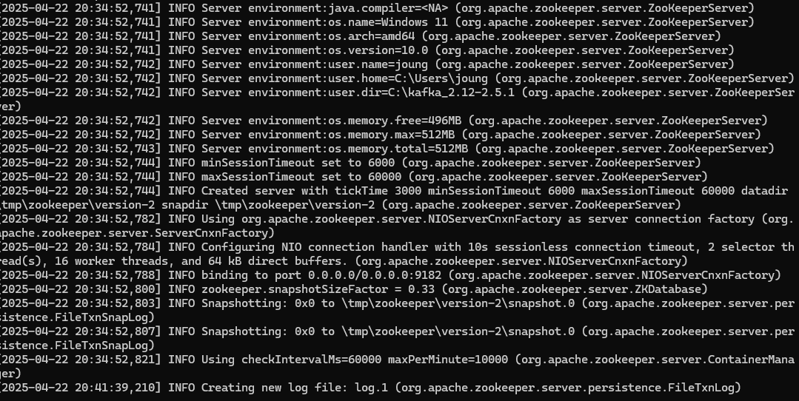
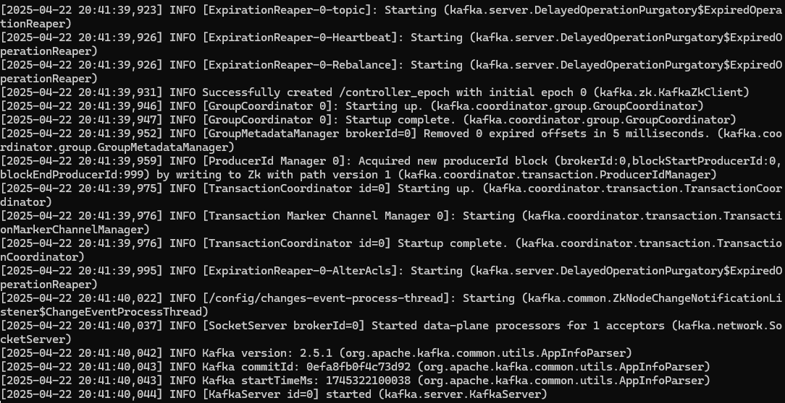
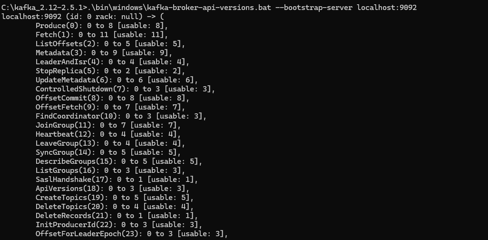
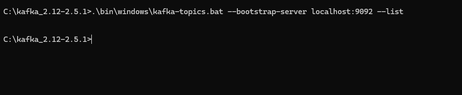

## 카프카 커맨드라인

카프카에서 제공하는 카프카 커맨드 라인 툴(command-line-tool)들은 카프카를 운영할 때 가장 많이 접하는 도구다. 커맨드 라인 툴을 통해 카프카 브로커 운영에 필요한 다양한 명령을 내릴 수 있다. 카프카 클라이언트 애플리케이션을 운영할 때는 카프카 클러스터와 연동하여 데이터를 주고받는 것도 중요하지만 토픽이나 파티션 개수 변경과 같은 명령을 실행해야 하는 경우도 발생한다. 떄문에 커맨드 라인툴과 각 툴별 옵션에 대해 알고 있어야 한다.

커맨드 라인 툴을 통해 토픽 관련 명령을 실행항 때 필수 옵션과 선택 옵션이 있다. 선택 옵션은 지정하지 않을시 브로커에 설정된 기본 설정값 또는 커맨드 라인 툴의 기본값으로 대체되어 설정된다. 따라서 설정된 기본 옵션이 어떻게 설정되어 있는지 확인하고 사용하면 실수할 확률이 줄어든다.

Apache Kafka CLI는 Kafka의 브로커, 토픽, 파티션 등 모든 요소를 관리하고 모니터링하기 위해 제공되는 명령줄 도구입니다. CLI 명령어는 주로 **Kafka 설치 디렉토리의 `/bin` 폴더**에서 실행됩니다.

> 기본 경로 예시
>
>
> `/kafka/bin`
>

### 설치 및 실행
1. https://kafka.apache.org/downloads
   - 설치 파일 kafka-2.5.0-src.tgz
2. 바이너리 파일 압축 해제
3. 주키퍼 실행
4. 카프카 바이너리 실행

### 파일 구조 (카프카 바이너리 압축 해제)
- LICENSE
- NOTICE
- bin
  - 실행할 바이너리 파일 및 sh파일
- config
  - server.properties 를 포함한 설정 파일
- libs
- site-docs
  
###   server.properties 파일 확인 해보기
```properties
# 브로커의 고유 ID (클러스터 내에서 중복되지 않도록 설정)
broker.id=0

# 네트워크 요청을 처리할 스레드 수 (클라이언트 연결/요청 처리용)
num.network.threads=3

# 디스크 입출력 작업을 처리할 스레드 수 (로그 세그먼트 읽기·쓰기용)
num.io.threads=8

# 로그 세그먼트(데이터 파일)를 저장할 디렉토리 경로 (콤마로 여러 개 지정 가능)
log.dirs=/Users/dvwy/Documents/test/kafka_2.12-2.5.0/data

# 새로 생성되는 토픽의 기본 파티션 수 (토픽별로 명시하지 않으면 이 값 사용)
num.partitions=3

# 클라이언트가 브로커에 접속할 리스너 프로토콜·호스트·포트
listeners=PLAINTEXT://localhost:9092

# 클라이언트에 광고되는 리스너 주소 (컨테이너·외부 접속 시 사용)
advertised.listeners=PLAINTEXT://localhost:9092

# 소켓 전송 시 OS 커널이 사용하는 send 버퍼 크기 (바이트)
socket.send.buffer.bytes=102400

# 소켓 수신 시 OS 커널이 사용하는 receive 버퍼 크기 (바이트)
socket.receive.buffer.bytes=102400

# 프로듀서/컨슈머 요청 시 허용할 최대 바이트 크기
socket.request.max.bytes=104857600

# 데이터 디렉토리당 로그 복구(leader election 등)용 스레드 수
num.recovery.threads.per.data.dir=1

# 내부 __consumer_offsets 토픽의 복제 팩터 (offset 관리용)
offsets.topic.replication.factor=1

# 트랜잭션 상태 로그 토픽(replication) 복제 팩터
transaction.state.log.replication.factor=1

# 트랜잭션 상태 로그 토픽 최소 ISR(in‑sync replicas) 수
transaction.state.log.min.isr=1

# 로그 세그먼트를 보관하는 최대 시간(시간 단위, 이 후 삭제 대상)
log.retention.hours=168

# 하나의 로그 세그먼트 파일 크기(바이트 단위, 이 크기 도달 시 새 세그먼트 생성)
log.segment.bytes=1073741824

# 로그 보관 정책 점검 주기(밀리초 단위)
log.retention.check.interval.ms=300000

# Zookeeper 연결 정보(호스트:포트 목록, 콤마로 구분)
zookeeper.connect=localhost:2181

# Zookeeper 세션 타임아웃(밀리초 단위)
zookeeper.connection.timeout.ms=18000

# 컨슈머 그룹 초기 리밸런스 전 대기 시간(밀리초 단위, 0이면 즉시 실행)
group.initial.rebalance.delay.ms=0


```

### 1. 주키퍼 실행
별다른 설정을 하지 않아도 기번적으로 `config/zookepper.properties`에 다음고 같이 설정 되어있다.
```properties
dataDir=/tmp/zookeeper
clientPort=2181
maxClientCnxns=0
admin.enableServer=false
```
실행은 `bin/zookper-server-start.sh config/zookeepr.properties`

  
### 2. 카프카 브로커 실행
실행은 `bin/kafka-server-start.sh config/server.properties`
  
### 3. 카프카 정상 실행 여부 확인
`bin/kafka-broker-api-versions.sh --bootstrap-server localhost:9002`
카프카 토픽 확인
`bin/kafka-topics.sh --bootstrap-server localhost:9002 --list`
  
  
### 로컬에서 실행해보기
먼저 `server.properties`에 들어가서 해당 옵션의 주석을 해제하고 설정을 변경한다.
리눅스 기준 확인 `cat config/server.properties| grep log.dirs`
```properties
# 브로커가 실제로 클라이언트(프로듀서/컨슈머)의 연결 요청을 수신하기 위해 
# 바인딩(bind)할 프로토콜·호스트·포트 설정
listeners=PLAINTEXT://localhost:9092

# 브로커가 클러스터 메타데이터를 통해 
# 프로듀서/컨슈머에게 “여기로 접속하세요”라고 광고(advertise)할 
# 프로토콜·호스트·포트 설정
# (미설정 시 listeners 값을, 그마저도 없으면 JVM 호스트네임을 사용)
advertised.listeners=PLAINTEXT://localhost:9092
# 로그 세그먼트 저장 위치변경
log.dirs=C:/kafka_2.12-2.5.1/data
```
윈도우 기준 주키퍼 실행 `.\bin\windows\zookeeper-server-start.bat .\config\zookeeper.properties`
  
주키퍼 실행시 이미 해당 포트를 사용하고 있다는 오류 메세지가 나오면 설정파일 포트를 변경하고, server.properties에서 주키퍼 포트를 같이 변경해 주면된다.  

브로커 실행 `.\bin\windows\kafka-server-start.bat .\config\server.properties`  
  
브로커 정상 동작 확인하기  
`.\bin\windows\kafka-broker-api-versions.bat --bootstrap-server localhost:9092`
  
`.\bin\windows\kafka-topics.bat --bootstrap-server localhost:9092 --list`
  
  
편의를 위해서 `C:\Windows\System32\drivers\etc\hosts` 파일에 `127.0.0.1`로컬 호스트를 `my-kafka`로설정하고 작업한다.  

## CLI 기본 사용법

CLI 명령은 스크립트로 제공되며 크게 다음과 같이 구성됩니다.

```bash

kafka-<기능명>-sh [옵션] [파라미터]

```

예시:

```bash

kafka-topics.sh --create --topic test-topic --bootstrap-server localhost:9092

```

## 주요 CLI 명령어 설명

###  `kafka-topics.sh` (토픽 관리)

토픽의 생성, 조회, 수정, 삭제 등의 작업 수행

**자주 사용하는 옵션:**

- `-create`: 새 토픽 생성
- `-list`: 토픽 목록 조회
- `-describe`: 특정 토픽의 상세 정보
- `-delete`: 토픽 삭제
- `-alter`: 기존 토픽 설정 변경

**토픽 생성 예시:**

```bash

kafka-topics.sh --create \
  --bootstrap-server localhost:9092 \
  --topic my-topic \
  --partitions 3 \
  --replication-factor 1

```

---

### `kafka-console-producer.sh` (메시지 생산)

토픽에 메시지를 전송하는 프로듀서 역할

기본 사용법:

```bash

kafka-console-producer.sh --topic my-topic --bootstrap-server localhost:9092

```

입력 후 엔터(Enter) 키를 누르면 메시지가 발송됩니다.

특정 파일의 내용을 Kafka에 전송할 때:

```bash

kafka-console-producer.sh --topic my-topic --bootstrap-server localhost:9092 < input.txt

```

---

### `kafka-console-consumer.sh` (메시지 소비)

토픽의 메시지를 실시간으로 소비하는 컨슈머 역할

**기본 사용법:**

```bash

kafka-console-consumer.sh --topic my-topic --bootstrap-server localhost:9092

```

옵션 설명:

- `-from-beginning`: 처음부터 메시지 소비
- `-group`: 컨슈머 그룹 지정

예시:

```bash

kafka-console-consumer.sh --topic my-topic \
  --bootstrap-server localhost:9092 \
  --from-beginning \
  --group my-group

```

---

### `kafka-consumer-groups.sh` (컨슈머 그룹 관리)

컨슈머 그룹의 상태 조회, offset 관리

주요 옵션:

- `-list`: 등록된 컨슈머 그룹 목록 조회
- `-describe`: 특정 컨슈머 그룹 상태 확인
- `-reset-offsets`: 컨슈머 그룹 offset 초기화 또는 변경

컨슈머 그룹 조회 예시:

```bash

kafka-consumer-groups.sh --bootstrap-server localhost:9092 --list

```

컨슈머 그룹 상태 상세조회:

```bash

kafka-consumer-groups.sh --bootstrap-server localhost:9092 \
  --describe --group my-group

```

컨슈머 offset 초기화 예시:

```bash

kafka-consumer-groups.sh --bootstrap-server localhost:9092 \
  --group my-group \
  --reset-offsets \
  --to-earliest \
  --topic my-topic \
  --execute

```

---

###  `kafka-configs.sh` (브로커/토픽 설정 관리)

동적으로 브로커 또는 토픽 설정을 변경하는 명령

예시 - 토픽 설정 변경(예: retention 기간 변경):

```bash

kafka-configs.sh --bootstrap-server localhost:9092 \
  --entity-type topics \
  --entity-name my-topic \
  --alter \
  --add-config retention.ms=3600000

```

---

###  `kafka-acls.sh` (권한 관리)

Kafka ACL(Access Control List) 권한 설정 및 관리 명령

사용자 권한 부여 예시:

```bash

kafka-acls.sh --bootstrap-server localhost:9092 \
  --add \
  --allow-principal User:Alice \
  --operation Read \
  --topic my-topic

```

---

###  `kafka-reassign-partitions.sh` (파티션 재배치)

파티션을 다른 브로커로 이동시키거나 재분배하는 명령

예시:

```bash

kafka-reassign-partitions.sh \
  --bootstrap-server localhost:9092 \
  --execute \
  --reassignment-json-file reassignment.json

```

(`reassignment.json` 파일 예시)

```json

{
  "version": 1,
  "partitions": [
    {"topic": "my-topic", "partition": 0, "replicas": [2,3]},
    {"topic": "my-topic", "partition": 1, "replicas": [3,1]}
  ]
}

```

---

###  `kafka-run-class.sh` (유틸리티 클래스 실행)

Kafka에 포함된 다양한 유틸 클래스 실행 가능

사용 예시 - 브로커 상태 확인:

```bash

kafka-run-class.sh kafka.admin.BrokerApiVersionsCommand --bootstrap-server localhost:9092

```

---

## 🔹 3. 자주 쓰는 Kafka CLI 사용 예시 모음 (실습용)

**토픽 조회:**

```bash

kafka-topics.sh --list --bootstrap-server localhost:9092

```

**메시지 전송 및 수신 (빠른 테스트):**

```bash

# Producer
kafka-console-producer.sh --topic quick-test --bootstrap-server localhost:9092

# Consumer (처음부터 수신)
kafka-console-consumer.sh --topic quick-test --from-beginning --bootstrap-server localhost:9092

```

**컨슈머 그룹 상태 확인:**

```bash

kafka-consumer-groups.sh --bootstrap-server localhost:9092 --describe --group my-group

```

---

## 🔹 4. Kafka CLI를 위한 환경 설정 (팁)

- CLI 명령을 사용하기 쉽게 `PATH` 환경변수에 추가:

```bash

export PATH=$PATH:/kafka/bin

```

- 각 CLI의 옵션 확인은 `-help` 추가:

```bash

kafka-topics.sh --help

```