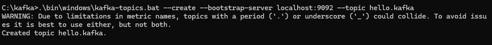
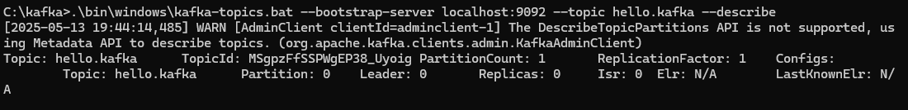
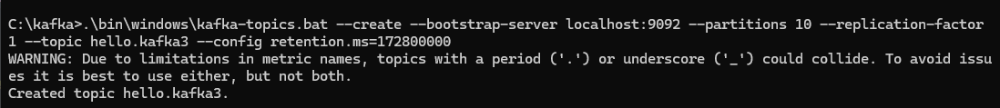
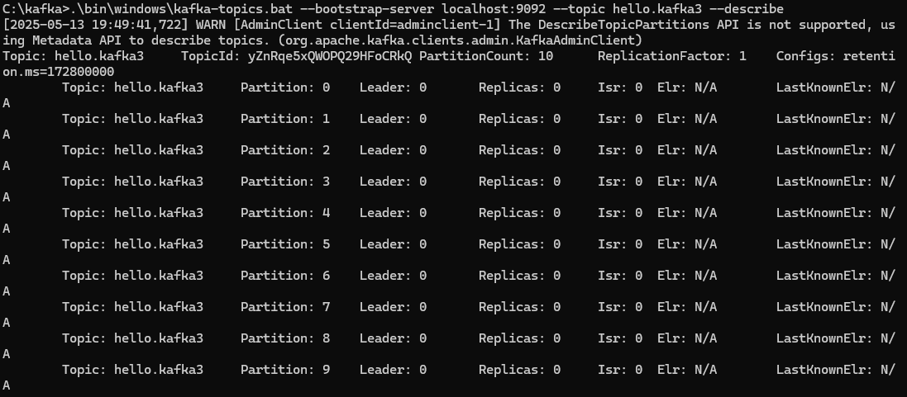
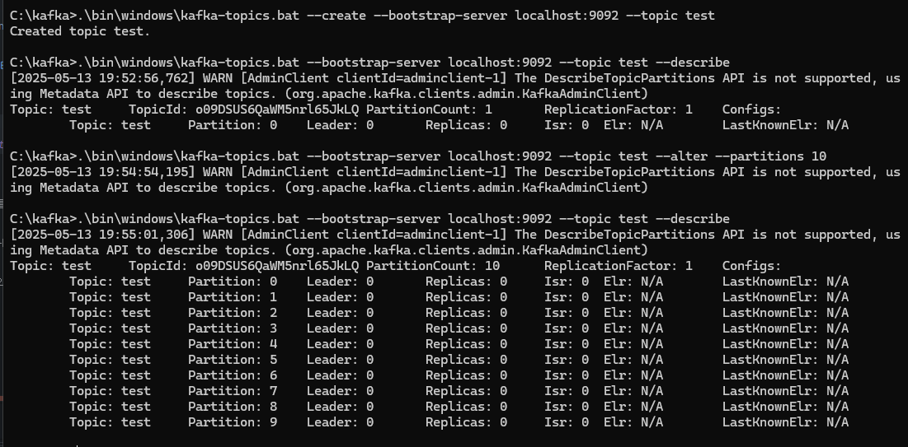
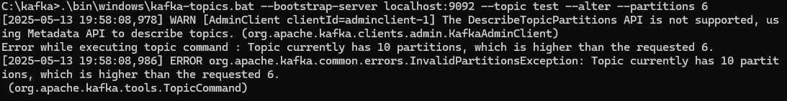
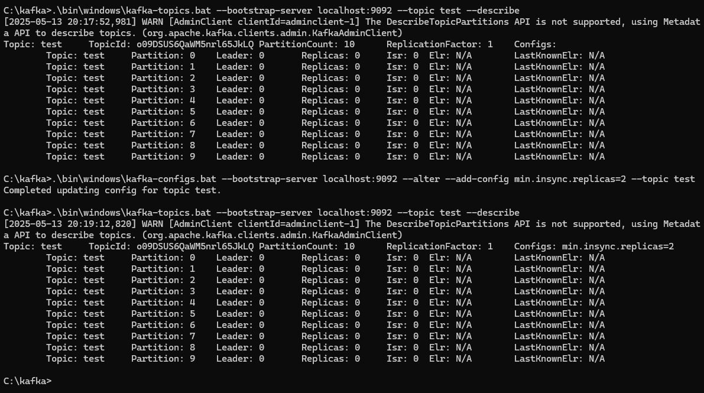
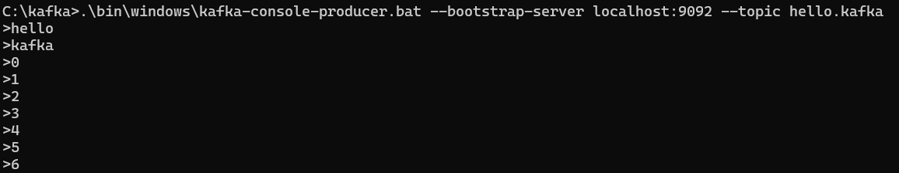
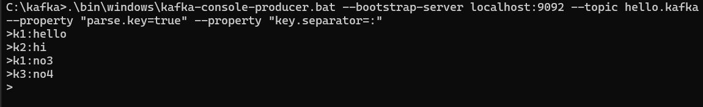

## 카프카 Shell Script
  
### kafka-topics.sh
카프카 클러스터 정보와 토픽 이름만으로 토픽을 생성할 수 있다. 클러스터 정보와 토픽 이름은 토픽을 만들기위 한 필수 값이다.  
  
이렇게 만들어진 토픽은 파티션 개수, 복제 개수등과 같이 다양한 옵션이 포함되어 있고 특별한 설정이 없으면 브로커에 설정된 기본값으로 생성된다.
### 기본 토픽 생성


```bash


# 기본 토픽 생성 문법
bin/kafka-topics.sh --create --topic [토픽명] --bootstrap-server [브로커주소:포트]

```

```bash


bin/kafka-topics.sh --create --topic my-first-topic --bootstrap-server localhost:9092

```
  

### 토픽 목록 조회

```bash


bin/kafka-topics.sh --list --bootstrap-server localhost:9092

```

### 특정 토픽 상세 정보 확인

```bash

bin/kafka-topics.sh --describe --topic my-topic --bootstrap-server localhost:9092

```
    
  
### 토픽 구성옵션
만약 파티션 개수, 복제 개수, 토픽 데이터 유지 기간 옵션들을 지정하여 토픽을 생성하고 싶다면 다음고 같이 명령어를 실행 하면된다.  
```bash 
bin/kafka-topics.sh --create --topic my-topic2 \
  --bootstrap-server localhost:9092 \
  --partitions 10 \
  --replication-factor 1 \
  --config retention.ms=172800000

```
  



### 토픽 파티션 수 변경 (증가만 가능) --alter 옵션

```bash

bin/kafka-topics.sh --alter --topic my-topic --partitions 6 --bootstrap-server localhost:9092

```


파티션 개수를 늘릴 수 있지만 줄일 수는 없다. 다시 줄이는 명령어를 호출하면 `InvalidPartitionsException`이 발생한다. 분산 시스템에서 이미 분산된 데이터를 줄이는 방법은 매우 복잡하다.  
  
삭제 대상 파티션을 지정해야할 뿐만 아니라 기존에 저장되어 있던 레코드를 분산하여 저장하는 로직이 필요하기 때문이다. 이 때문에 카프카에서는 파티션을 줄이는 로직은 제공하지 않는다.  
  
만약 파티션의 개수를 줄여야 할 때는 토픽을 새로 만드는 편이 좋다.
  
  
  

---
  
### kafka-configs.sh
토픽의 일부 옵션을 설정하기 위해서는 `kafka-configs.sh` 명령어를 사용해야 한다. `--alter` 과 `--add-config` 옵션을 사용하여 `min.insync.replicas` 옵션을 토픽별로 설정할 수 있다.
  

---

## min.insync.replicas란?

`min.insync.replicas`는 Kafka에서 데이터 내구성(durability)과 가용성(availability)의 균형을 조정하는 중요한 구성 옵션입니다. 이 설정은 쓰기 작업이 성공적으로 간주되기 위해 동기화되어야 하는 최소 복제본(replica) 수를 지정합니다.

## 기본 개념

Kafka에서:

- 각 파티션은 여러 브로커에 복제될 수 있습니다 (복제 팩터/replication factor).
- 각 파티션에는 하나의 리더(leader)와 여러 팔로워(follower)가 있습니다.
- ISR(In-Sync Replicas)은 리더와 충분히 동기화된 복제본 집합입니다.

## min.insync.replicas의 작동 방식

프로듀서가 `acks=all` (또는 `acks=-1`)로 설정된 상태에서 메시지를 보낼 때:

1. 리더는 메시지를 받습니다.
2. 팔로워들은 리더로부터 메시지를 복제합니다.
3. 리더는 **적어도 `min.insync.replicas` 수의 복제본(리더 포함)이 메시지를 복제할 때까지** 기다립니다.
4. 충분한 수의 복제본이 동기화되면 프로듀서에 성공 응답을 보냅니다.

만약 ISR(In-Sync Replicas)의 수가 `min.insync.replicas` 값보다 적으면, 리더는 `NotEnoughReplicasException` 또는 `NotEnoughReplicasAfterAppendException` 예외를 발생시켜 쓰기 요청을 거부합니다.

## 설정 값의 의미

`min.insync.replicas`는 일반적으로 1~3 사이의 값을 가집니다:

- **min.insync.replicas=1** (기본값)
    - 의미: 리더만 동기화되면 쓰기 성공으로 간주
    - 장점: 높은 가용성 (브로커 장애가 있어도 쓰기 계속 가능)
    - 단점: 낮은 데이터 내구성 (리더 손실 시 데이터 손실 가능성)
- **min.insync.replicas=2**
    - 의미: 최소 2개의 복제본(리더 + 1개 팔로워)이 동기화되어야 함
    - 권장: 복제 팩터 3인 경우 균형 잡힌 설정
    - 특징: 1개 브로커 장애 시에도 쓰기 가능, 일정 수준의 내구성 제공
- **min.insync.replicas=3**
    - 의미: 최소 3개의 복제본이 동기화되어야 함
    - 특징: 높은 내구성, 낮은 가용성
    - 단점: 하나의 브로커라도 장애가 발생하면 쓰기 불가능  
  
### 명령어
```bash 
bin/kafka-configs.sh --bootstrap-server localhost:9092 --alter \
  --add-config min.insync.replicas=2 \
  --topic test
```
    

또한 server.properties 파일에 저장된 각종 브로커에 대한 기본값을 `--broker`, `--all`, `--describe` 옵션을 사용하여 조회할 수 있다.  
```
C:\kafka>.\bin\windows\kafka-configs.bat --bootstrap-server localhost:9092 --broker 0 --all --describe
All configs for broker 0 are:
  advertised.listeners=null sensitive=false synonyms={}
  alter.config.policy.class.name=null sensitive=false synonyms={}
  alter.log.dirs.replication.quota.window.num=11 sensitive=false synonyms={DEFAULT_CONFIG:alter.log.dirs.replication.quota.window.num=11}
  alter.log.dirs.replication.quota.window.size.seconds=1 sensitive=false synonyms={DEFAULT_CONFIG:alter.log.dirs.replication.quota.window.size.seconds=1}
  authorizer.class.name= sensitive=false synonyms={DEFAULT_CONFIG:authorizer.class.name=}
  auto.create.topics.enable=true sensitive=false synonyms={DEFAULT_CONFIG:auto.create.topics.enable=true}
  auto.include.jmx.reporter=true sensitive=false synonyms={DEFAULT_CONFIG:auto.include.jmx.reporter=true}
  auto.leader.rebalance.enable=true sensitive=false synonyms={DEFAULT_CONFIG:auto.leader.rebalance.enable=true}
  background.threads=10 sensitive=false synonyms={DEFAULT_CONFIG:background.threads=10}
  broker.heartbeat.interval.ms=2000 sensitive=false synonyms={DEFAULT_CONFIG:broker.heartbeat.interval.ms=2000}
  broker.id=0 sensitive=false synonyms={STATIC_BROKER_CONFIG:broker.id=0, DEFAULT_CONFIG:broker.id=-1}
  broker.id.generation.enable=true sensitive=false synonyms={DEFAULT_CONFIG:broker.id.generation.enable=true}
  broker.rack=null sensitive=false synonyms={}
  broker.session.timeout.ms=9000 sensitive=false synonyms={DEFAULT_CONFIG:broker.session.timeout.ms=9000}
  client.quota.callback.class=null sensitive=false synonyms={}
  compression.gzip.level=-1 sensitive=false synonyms={DEFAULT_CONFIG:compression.gzip.level=-1}
  compression.lz4.level=9 sensitive=false synonyms={DEFAULT_CONFIG:compression.lz4.level=9}
  compression.type=producer sensitive=false synonyms={DEFAULT_CONFIG:compression.type=producer}
  compression.zstd.level=3 sensitive=false synonyms={DEFAULT_CONFIG:compression.zstd.level=3}
  connection.failed.authentication.delay.ms=100 sensitive=false synonyms={DEFAULT_CONFIG:connection.failed.authentication.delay.ms=100}
  connections.max.idle.ms=600000 sensitive=false synonyms={DEFAULT_CONFIG:connections.max.idle.ms=600000}
  connections.max.reauth.ms=0 sensitive=false synonyms={DEFAULT_CONFIG:connections.max.reauth.ms=0}
  control.plane.listener.name=null sensitive=false synonyms={}
  controlled.shutdown.enable=true sensitive=false synonyms={DEFAULT_CONFIG:controlled.shutdown.enable=true}
  controlled.shutdown.max.retries=3 sensitive=false synonyms={DEFAULT_CONFIG:controlled.shutdown.max.retries=3}
  controlled.shutdown.retry.backoff.ms=5000 sensitive=false synonyms={DEFAULT_CONFIG:controlled.shutdown.retry.backoff.ms=5000}
  controller.listener.names=null sensitive=false synonyms={}
  ...
```
  

---
  
### kafka-console-producer.sh
토픽에 데이터를 넣을 수 있는 `kafka-console-producer.sh` 명령어를 실행해 보자. 키보드로 문자를 작성하고 엔터 키를 누르면 메시지 값이 전송된다.  
```bash 
bin/kafka-console-producer.sh --bootstrap-server localhost:9092 \
--topic test
>hello
>kafka

```
    

이때 메시지 키를 가지는 레코드를 전송하기 위해서는 몇가지 추가 옵션을 작성해야한다. `key.separator`를 선언하지 않으면 기본 설정은 Tab delimiter(\t)이므로  
`key.separator`를 선언하지 않고 메시지를 보내려면 메시지 키를 작성하고 탭키를 누른 뒤 메시지 값을 작성하고 엔터를 누른다. 여기서는 명시적으로 확인하기 위해 :을 구분자로 선언
```bash 
bin/kafka-console-producer.sh --bootstrap-server localhost:9092 \
--topic test \
--property "parse.key=true" \
--property "keh.separator=:" \

```
    

###  메시지 키와 메시지 값이 포함된 레코드가 파티션에 전송됨  
```
┌─────────────────────────────────────────────────────┐
│                    프로듀서                          │
│                                                     │
│  ┌───────────────┐    ┌───────────────────────┐    │
│  │ 레코드 배치 #1  │    │ 레코드 배치 #2        │    │
│  │ ┌───────────┐ │    │ ┌───────────┐         │    │
│  │ │key: null  │ │    │ │key: "user1"│        │    │
│  │ │value: "A" │ │    │ │value: "X"  │        │    │
│  │ └───────────┘ │    │ └───────────┘         │    │
│  │ ┌───────────┐ │    │ ┌───────────┐         │    │
│  │ │key: null  │ │    │ │key: "user2"│        │    │
│  │ │value: "B" │ │    │ │value: "Y"  │        │    │
│  │ └───────────┘ │    │ └───────────┘         │    │
│  │ ┌───────────┐ │    │ ┌───────────┐         │    │
│  │ │key: null  │ │    │ │key: "user1"│        │    │
│  │ │value: "C" │ │    │ │value: "Z"  │        │    │
│  │ └───────────┘ │    │ └───────────┘         │    │
│  └───────────────┘    └───────────────────────┘    │
└─────────────────────────────────────────────────────┘
           │                      │
           ▼                      ▼
┌───────────────────────────────────────────────────────┐
│                   파티션 할당 로직                      │
│                                                       │
│  ┌───────────────────┐      ┌────────────────────┐    │
│  │ 케이스 1: key = null │      │  케이스 2: key 존재   │    │
│  │                   │      │                    │    │
│  │  라운드 로빈 방식    │      │    해시 기반 할당     │    │
│  │  (배치 단위로)      │      │  hash(key) % 파티션수 │    │
│  └───────────────────┘      └────────────────────┘    │
└───────────────────────────────────────────────────────┘
           │                      │
           ▼                      ▼
┌─────────────────────────────────────────────────────────────────────────┐
│                              토픽 (3개의 파티션)                           │
│                                                                         │
│  ┌───────────────┐      ┌───────────────┐      ┌───────────────┐        │
│  │  파티션 0      │      │   파티션 1     │      │   파티션 2     │        │
│  │               │      │               │      │               │        │
│  │ ┌───────────┐ │      │ ┌───────────┐ │      │ ┌───────────┐ │        │
│  │ │key: null  │ │      │  라운드 로빈  │ │      │ ┌───────────┐ │        │
│  │ │value: "A" │ │      │  적용 없음   │ │      │ │key: "user1"│ │        │
│  │ └───────────┘ │      │              │ │      │ │value: "X" │ │        │
│  │               │      │              │ │      │ └───────────┘ │        │
│  │               │      │              │ │      │ ┌───────────┐ │        │
│  │               │      │ ┌───────────┐ │      │ │key: "user1"│ │        │
│  │               │      │ │key: null  │ │      │ │value: "Z" │ │        │
│  │               │      │ │value: "B" │ │      │ └───────────┘ │        │
│  │               │      │ └───────────┘ │      │               │        │
│  │               │      │               │      │               │        │
│  │               │      │               │      │               │        │
│  │               │      │               │      │               │        │
│  │               │      │ ┌───────────┐ │      │ ┌───────────┐ │        │
│  │               │      │ │key: null  │ │      │ │key: "user2"│ │        │
│  │               │      │ │value: "C" │ │      │ │value: "Y" │ │        │
│  │               │      │ └───────────┘ │      │ └───────────┘ │        │
│  └───────────────┘      └───────────────┘      └───────────────┘        │
└─────────────────────────────────────────────────────────────────────────┘
```
메시지 키와 메시지 값을 함께 전송한 레코드는 토픽의 파티션에 저장된다. 메시지 키가 null인 경우에는 프로듀서가 파티션으로 전송할때 레코드 배치 단위(레코드 전송 묶음)로 라운드 로빈으로 전송한다.  
메시지 키가 존재하는 경우에는 키의 해시값을 작성하여 존재하는 파티션 중 한개에 할당된다. 이로 인해 메시지키가 동일한 경우에는 동일한 파티션에 전송된다.  
  
이때 동일한 키값을 가지고 있는 `user1`은 파티션2에만 존재하는 것을 확인할 수 있고 이때 서로다른 키역시 파티션2에 존재할 수 있다.  
이는 카프카에서 메시지 키가 있는 레코드는 해시 함수에 의해 특정 파티션에 일관되게 할당됩니다. 예를 들어, `user1`이라는 키를 가진 모든 메시지는 해시 함수 `hash("user1") % 파티션 수`의 결과에 따라 항상 동일한 파티션(예: 파티션 2)에 저장됩니다.  
이는 우연이 아닌 카프카의 설계된 동작 방식입니다.

중요한 점은 서로 다른 키들도 동일한 파티션에 할당될 수 있다는 것입니다. 예를 들어, `user1`과 `user2`의 해시값이 모두 파티션 2로 매핑될 수 있습니다. 이는 해시 함수의 특성과 제한된 파티션 수 때문에 발생하는 자연스러운 현상입니다. 즉, 하나의 파티션에는 여러 다른 키를 가진 메시지들이 공존할 수 있으나, 동일한 키를 가진 메시지들은 반드시 같은 파티션에만 존재합니다.
  
여기서 `user1`이라는 키가 한개의 파티션에 동일하게 적재되는 것이 중요하고 동일한 메시지키를 가지고 있는 레코드들에 대해서 순서를 지킬 수 있는 것이 중요하다.