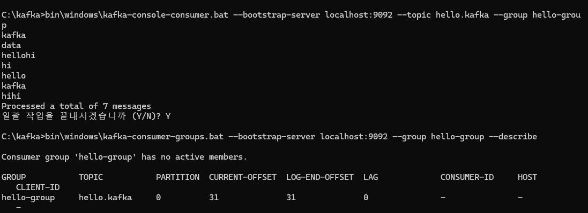

## 카프카 Shell Script
  
### kafka-topics.sh
카프카 클러스터 정보와 토픽 이름만으로 토픽을 생성할 수 있다. 클러스터 정보와 토픽 이름은 토픽을 만들기위 한 필수 값이다.  
  
이렇게 만들어진 토픽은 파티션 개수, 복제 개수등과 같이 다양한 옵션이 포함되어 있고 특별한 설정이 없으면 브로커에 설정된 기본값으로 생성된다.
### 기본 토픽 생성


```bash


# 기본 토픽 생성 문법
bin/kafka-topics.sh --create --topic [토픽명] --bootstrap-server [브로커주소:포트]

```

```bash


bin/kafka-topics.sh --create --topic my-first-topic --bootstrap-server localhost:9092

```
  

### 토픽 목록 조회

```bash


bin/kafka-topics.sh --list --bootstrap-server localhost:9092

```

### 특정 토픽 상세 정보 확인

```bash

bin/kafka-topics.sh --describe --topic my-topic --bootstrap-server localhost:9092

```
    
  
### 토픽 구성옵션
만약 파티션 개수, 복제 개수, 토픽 데이터 유지 기간 옵션들을 지정하여 토픽을 생성하고 싶다면 다음고 같이 명령어를 실행 하면된다.  
```bash 
bin/kafka-topics.sh --create --topic my-topic2 \
  --bootstrap-server localhost:9092 \
  --partitions 10 \
  --replication-factor 1 \
  --config retention.ms=172800000

```
  


### 토픽 파티션 수 변경 (증가만 가능) --alter 옵션

```bash

bin/kafka-topics.sh --alter --topic my-topic --partitions 6 --bootstrap-server localhost:9092

```


파티션 개수를 늘릴 수 있지만 줄일 수는 없다. 다시 줄이는 명령어를 호출하면 `InvalidPartitionsException`이 발생한다. 분산 시스템에서 이미 분산된 데이터를 줄이는 방법은 매우 복잡하다.  
  
삭제 대상 파티션을 지정해야할 뿐만 아니라 기존에 저장되어 있던 레코드를 분산하여 저장하는 로직이 필요하기 때문이다. 이 때문에 카프카에서는 파티션을 줄이는 로직은 제공하지 않는다.  
  
만약 파티션의 개수를 줄여야 할 때는 토픽을 새로 만드는 편이 좋다.
  
  
  

---
  
### kafka-configs.sh
토픽의 일부 옵션을 설정하기 위해서는 `kafka-configs.sh` 명령어를 사용해야 한다. `--alter` 과 `--add-config` 옵션을 사용하여 `min.insync.replicas` 옵션을 토픽별로 설정할 수 있다.
  

---

## min.insync.replicas란?

`min.insync.replicas`는 Kafka에서 데이터 내구성(durability)과 가용성(availability)의 균형을 조정하는 중요한 구성 옵션입니다. 이 설정은 쓰기 작업이 성공적으로 간주되기 위해 동기화되어야 하는 최소 복제본(replica) 수를 지정합니다.

## 기본 개념

Kafka에서:

- 각 파티션은 여러 브로커에 복제될 수 있습니다 (복제 팩터/replication factor).
- 각 파티션에는 하나의 리더(leader)와 여러 팔로워(follower)가 있습니다.
- ISR(In-Sync Replicas)은 리더와 충분히 동기화된 복제본 집합입니다.

## min.insync.replicas의 작동 방식

프로듀서가 `acks=all` (또는 `acks=-1`)로 설정된 상태에서 메시지를 보낼 때:

1. 리더는 메시지를 받습니다.
2. 팔로워들은 리더로부터 메시지를 복제합니다.
3. 리더는 **적어도 `min.insync.replicas` 수의 복제본(리더 포함)이 메시지를 복제할 때까지** 기다립니다.
4. 충분한 수의 복제본이 동기화되면 프로듀서에 성공 응답을 보냅니다.

만약 ISR(In-Sync Replicas)의 수가 `min.insync.replicas` 값보다 적으면, 리더는 `NotEnoughReplicasException` 또는 `NotEnoughReplicasAfterAppendException` 예외를 발생시켜 쓰기 요청을 거부합니다.

## 설정 값의 의미

`min.insync.replicas`는 일반적으로 1~3 사이의 값을 가집니다:

- **min.insync.replicas=1** (기본값)
    - 의미: 리더만 동기화되면 쓰기 성공으로 간주
    - 장점: 높은 가용성 (브로커 장애가 있어도 쓰기 계속 가능)
    - 단점: 낮은 데이터 내구성 (리더 손실 시 데이터 손실 가능성)
- **min.insync.replicas=2**
    - 의미: 최소 2개의 복제본(리더 + 1개 팔로워)이 동기화되어야 함
    - 권장: 복제 팩터 3인 경우 균형 잡힌 설정
    - 특징: 1개 브로커 장애 시에도 쓰기 가능, 일정 수준의 내구성 제공
- **min.insync.replicas=3**
    - 의미: 최소 3개의 복제본이 동기화되어야 함
    - 특징: 높은 내구성, 낮은 가용성
    - 단점: 하나의 브로커라도 장애가 발생하면 쓰기 불가능  
  
### 명령어
```bash 
bin/kafka-configs.sh --bootstrap-server localhost:9092 --alter \
  --add-config min.insync.replicas=2 \
  --topic test
```
    

또한 server.properties 파일에 저장된 각종 브로커에 대한 기본값을 `--broker`, `--all`, `--describe` 옵션을 사용하여 조회할 수 있다.  
```
C:\kafka>.\bin\windows\kafka-configs.bat --bootstrap-server localhost:9092 --broker 0 --all --describe
All configs for broker 0 are:
  advertised.listeners=null sensitive=false synonyms={}
  alter.config.policy.class.name=null sensitive=false synonyms={}
  alter.log.dirs.replication.quota.window.num=11 sensitive=false synonyms={DEFAULT_CONFIG:alter.log.dirs.replication.quota.window.num=11}
  alter.log.dirs.replication.quota.window.size.seconds=1 sensitive=false synonyms={DEFAULT_CONFIG:alter.log.dirs.replication.quota.window.size.seconds=1}
  authorizer.class.name= sensitive=false synonyms={DEFAULT_CONFIG:authorizer.class.name=}
  auto.create.topics.enable=true sensitive=false synonyms={DEFAULT_CONFIG:auto.create.topics.enable=true}
  auto.include.jmx.reporter=true sensitive=false synonyms={DEFAULT_CONFIG:auto.include.jmx.reporter=true}
  auto.leader.rebalance.enable=true sensitive=false synonyms={DEFAULT_CONFIG:auto.leader.rebalance.enable=true}
  background.threads=10 sensitive=false synonyms={DEFAULT_CONFIG:background.threads=10}
  broker.heartbeat.interval.ms=2000 sensitive=false synonyms={DEFAULT_CONFIG:broker.heartbeat.interval.ms=2000}
  broker.id=0 sensitive=false synonyms={STATIC_BROKER_CONFIG:broker.id=0, DEFAULT_CONFIG:broker.id=-1}
  broker.id.generation.enable=true sensitive=false synonyms={DEFAULT_CONFIG:broker.id.generation.enable=true}
  broker.rack=null sensitive=false synonyms={}
  broker.session.timeout.ms=9000 sensitive=false synonyms={DEFAULT_CONFIG:broker.session.timeout.ms=9000}
  client.quota.callback.class=null sensitive=false synonyms={}
  compression.gzip.level=-1 sensitive=false synonyms={DEFAULT_CONFIG:compression.gzip.level=-1}
  compression.lz4.level=9 sensitive=false synonyms={DEFAULT_CONFIG:compression.lz4.level=9}
  compression.type=producer sensitive=false synonyms={DEFAULT_CONFIG:compression.type=producer}
  compression.zstd.level=3 sensitive=false synonyms={DEFAULT_CONFIG:compression.zstd.level=3}
  connection.failed.authentication.delay.ms=100 sensitive=false synonyms={DEFAULT_CONFIG:connection.failed.authentication.delay.ms=100}
  connections.max.idle.ms=600000 sensitive=false synonyms={DEFAULT_CONFIG:connections.max.idle.ms=600000}
  connections.max.reauth.ms=0 sensitive=false synonyms={DEFAULT_CONFIG:connections.max.reauth.ms=0}
  control.plane.listener.name=null sensitive=false synonyms={}
  controlled.shutdown.enable=true sensitive=false synonyms={DEFAULT_CONFIG:controlled.shutdown.enable=true}
  controlled.shutdown.max.retries=3 sensitive=false synonyms={DEFAULT_CONFIG:controlled.shutdown.max.retries=3}
  controlled.shutdown.retry.backoff.ms=5000 sensitive=false synonyms={DEFAULT_CONFIG:controlled.shutdown.retry.backoff.ms=5000}
  controller.listener.names=null sensitive=false synonyms={}
  ...
```
  

---
  
### kafka-console-producer.sh
토픽에 데이터를 넣을 수 있는 `kafka-console-producer.sh` 명령어를 실행해 보자. 키보드로 문자를 작성하고 엔터 키를 누르면 메시지 값이 전송된다.  
```bash 
bin/kafka-console-producer.sh --bootstrap-server localhost:9092 \
--topic test
>hello
>kafka

```
    

이때 메시지 키를 가지는 레코드를 전송하기 위해서는 몇가지 추가 옵션을 작성해야한다. `key.separator`를 선언하지 않으면 기본 설정은 Tab delimiter(\t)이므로  
`key.separator`를 선언하지 않고 메시지를 보내려면 메시지 키를 작성하고 탭키를 누른 뒤 메시지 값을 작성하고 엔터를 누른다. 여기서는 명시적으로 확인하기 위해 :을 구분자로 선언
```bash 
bin/kafka-console-producer.sh --bootstrap-server localhost:9092 \
--topic test \
--property "parse.key=true" \
--property "keh.separator=:" \

```
    

###  메시지 키와 메시지 값이 포함된 레코드가 파티션에 전송됨  
```
┌─────────────────────────────────────────────────────┐
│                    프로듀서                          │
│                                                     │
│  ┌───────────────┐    ┌───────────────────────┐    │
│  │ 레코드 배치 #1  │    │ 레코드 배치 #2        │    │
│  │ ┌───────────┐ │    │ ┌───────────┐         │    │
│  │ │key: null  │ │    │ │key: "user1"│        │    │
│  │ │value: "A" │ │    │ │value: "X"  │        │    │
│  │ └───────────┘ │    │ └───────────┘         │    │
│  │ ┌───────────┐ │    │ ┌───────────┐         │    │
│  │ │key: null  │ │    │ │key: "user2"│        │    │
│  │ │value: "B" │ │    │ │value: "Y"  │        │    │
│  │ └───────────┘ │    │ └───────────┘         │    │
│  │ ┌───────────┐ │    │ ┌───────────┐         │    │
│  │ │key: null  │ │    │ │key: "user1"│        │    │
│  │ │value: "C" │ │    │ │value: "Z"  │        │    │
│  │ └───────────┘ │    │ └───────────┘         │    │
│  └───────────────┘    └───────────────────────┘    │
└─────────────────────────────────────────────────────┘
           │                      │
           ▼                      ▼
┌───────────────────────────────────────────────────────┐
│                   파티션 할당 로직                      │
│                                                       │
│  ┌───────────────────┐      ┌────────────────────┐    │
│  │ 케이스 1: key = null │      │  케이스 2: key 존재   │    │
│  │                   │      │                    │    │
│  │  라운드 로빈 방식    │      │    해시 기반 할당     │    │
│  │  (배치 단위로)      │      │  hash(key) % 파티션수 │    │
│  └───────────────────┘      └────────────────────┘    │
└───────────────────────────────────────────────────────┘
           │                      │
           ▼                      ▼
┌─────────────────────────────────────────────────────────────────────────┐
│                              토픽 (3개의 파티션)                           │
│                                                                         │
│  ┌───────────────┐      ┌───────────────┐      ┌───────────────┐        │
│  │  파티션 0      │      │   파티션 1     │      │   파티션 2     │        │
│  │               │      │               │      │               │        │
│  │ ┌───────────┐ │      │ ┌───────────┐ │      │ ┌───────────┐ │        │
│  │ │key: null  │ │      │  라운드 로빈  │ │      │ ┌───────────┐ │        │
│  │ │value: "A" │ │      │  적용 없음   │ │      │ │key: "user1"│ │        │
│  │ └───────────┘ │      │              │ │      │ │value: "X" │ │        │
│  │               │      │              │ │      │ └───────────┘ │        │
│  │               │      │              │ │      │ ┌───────────┐ │        │
│  │               │      │ ┌───────────┐ │      │ │key: "user1"│ │        │
│  │               │      │ │key: null  │ │      │ │value: "Z" │ │        │
│  │               │      │ │value: "B" │ │      │ └───────────┘ │        │
│  │               │      │ └───────────┘ │      │               │        │
│  │               │      │               │      │               │        │
│  │               │      │               │      │               │        │
│  │               │      │               │      │               │        │
│  │               │      │ ┌───────────┐ │      │ ┌───────────┐ │        │
│  │               │      │ │key: null  │ │      │ │key: "user2"│ │        │
│  │               │      │ │value: "C" │ │      │ │value: "Y" │ │        │
│  │               │      │ └───────────┘ │      │ └───────────┘ │        │
│  └───────────────┘      └───────────────┘      └───────────────┘        │
└─────────────────────────────────────────────────────────────────────────┘
```
메시지 키와 메시지 값을 함께 전송한 레코드는 토픽의 파티션에 저장된다. 메시지 키가 null인 경우에는 프로듀서가 파티션으로 전송할때 레코드 배치 단위(레코드 전송 묶음)로 라운드 로빈으로 전송한다.  
메시지 키가 존재하는 경우에는 키의 해시값을 작성하여 존재하는 파티션 중 한개에 할당된다. 이로 인해 메시지키가 동일한 경우에는 동일한 파티션에 전송된다.  
  
이때 동일한 키값을 가지고 있는 `user1`은 파티션2에만 존재하는 것을 확인할 수 있고 이때 서로다른 키역시 파티션2에 존재할 수 있다.  
이는 카프카에서 메시지 키가 있는 레코드는 해시 함수에 의해 특정 파티션에 일관되게 할당됩니다. 예를 들어, `user1`이라는 키를 가진 모든 메시지는 해시 함수 `hash("user1") % 파티션 수`의 결과에 따라 항상 동일한 파티션(예: 파티션 2)에 저장됩니다.  
이는 우연이 아닌 카프카의 설계된 동작 방식입니다.

중요한 점은 서로 다른 키들도 동일한 파티션에 할당될 수 있다는 것입니다. 예를 들어, `user1`과 `user2`의 해시값이 모두 파티션 2로 매핑될 수 있습니다. 이는 해시 함수의 특성과 제한된 파티션 수 때문에 발생하는 자연스러운 현상입니다. 즉, 하나의 파티션에는 여러 다른 키를 가진 메시지들이 공존할 수 있으나, 동일한 키를 가진 메시지들은 반드시 같은 파티션에만 존재합니다.
  
여기서 `user1`이라는 키가 한개의 파티션에 동일하게 적재되는 것이 중요하고 동일한 메시지키를 가지고 있는 레코드들에 대해서 순서를 지킬 수 있는 것이 중요하다.  
  

---
  
### kafka-console-consumer.sh
카프카 토픽에 저장된 데이터를 확인하기 위해서는 `kafka-console-consumer.sh` 명령어를 사용합니다.

### 기본 사용법

```bash

bin/kafka-console-consumer.sh --bootstrap-server [브로커주소:포트] --topic [토픽명]

```

이 명령어를 실행하면 토픽에 새로 추가되는 메시지만 실시간으로 보여줍니다. 기본적으로는 명령어 실행 시점 이후에 토픽에 들어오는 메시지만 볼 수 있습니다.

### 토픽의 처음부터 모든 메시지 확인

토픽에 저장된 모든 메시지를 처음부터 확인하기 위해서는 `--from-beginning` 옵션을 추가합니다.

```bash

bin/kafka-console-consumer.sh --bootstrap-server localhost:9092 \
--topic test \
--from-beginning

```
  

### 메시지 키와 값 함께 확인하기

토픽에 저장된 레코드의 메시지 키와 값을 함께 확인하기 위해서는 추가 옵션이 필요합니다.

```bash

bin/kafka-console-consumer.sh --bootstrap-server localhost:9092 \
--topic test \
--property print.key=true \
--property key.separator="-" \
--from-beginning

```
  

이 명령어를 실행하면 `메시지키-메시지값` 형태로 출력됩니다. 메시지 키가 없는 경우 `null-메시지값` 형태로 표시됩니다.

### 최대 메시지 개수 제한

최대로 읽을 메시지 개수를 제한하려면 `--max-messages` 옵션을 사용합니다.

```bash

bin/kafka-console-consumer.sh --bootstrap-server localhost:9092 \
--topic test \
--from-beginning \
--max-messages 10

```
  

이 명령어는 최대 10개의 메시지만 출력한 후 종료됩니다.

### 특정 파티션의 메시지만 확인

특정 파티션에 저장된 메시지만 확인하려면 `--partition` 옵션을 사용합니다.

```bash

bin/kafka-console-consumer.sh --bootstrap-server localhost:9092 \
--topic test \
--partition 0 \
--from-beginning

```
  
  

### 컨슈머 그룹 사용하기

컨슈머 그룹을 지정하여 오프셋을 자동으로 커밋하려면 `--group` 옵션을 사용합니다.

```bash

bin/kafka-console-consumer.sh --bootstrap-server localhost:9092 \
--topic test \
--group my-consumer-group

```
  
  
  

컨슈머 그룹이란 특정 목적을 가진 컨슈머들을 묶음으로 사용하는 것을 뜻한다.

이 방식으로 컨슈머 그룹을 지정하면 읽은 오프셋 정보가 카프카에 저장되어, 다음에 같은 그룹으로 실행했을 때 이전에 읽었던 다음 메시지부터 계속 읽을 수 있습니다.
  
컨슈머 그룹을 사용했을때 현재 어디까지 정보를 읽었는지에 대한 커밋정보를 `__consumer_offsets` 토픽에 저장된다.

### 특정 오프셋부터 메시지 확인

특정 오프셋부터 메시지를 확인하려면 `--offset` 옵션을 사용합니다.

```bash

bin/kafka-console-consumer.sh --bootstrap-server localhost:9092 \
--topic test \
--partition 0 \
--offset 10

```

이 명령어는 토픽의 0번 파티션에서 10번 오프셋부터 메시지를 출력합니다.  
  

---  
### kafka-consumer-groups.sh
카프카에서 컨슈머 그룹 정보를 관리하고 모니터링하기 위해 `kafka-consumer-groups.sh` 명령어를 사용합니다. 이 명령어는 컨슈머 그룹의 오프셋 정보, 멤버십, 파티션 할당 상태 등을 확인하고 관리할 수 있는 다양한 기능을 제공합니다.

위의 예제에서  hello-group 이름의 컨슈머 그룹으로 생성된 컨슈머 hello.kafka 토픽의 데이터를 가져갔다. 그룹은 따로 생성하는 명령을 날리지 않고 컨슈머를 동작할 때 컨슈머 그룹이름을 지정하면 새로 생성된다.

### 컨슈머 그룹 목록 조회

```bash

# 모든 컨슈머 그룹 목록 조회
bin/kafka-consumer-groups.sh --bootstrap-server localhost:9092 --list

```
  

이 명령어는 클러스터에 등록된 모든 컨슈머 그룹을 나열합니다.

### 특정 컨슈머 그룹 상세 정보 확인

```bash

# 특정 컨슈머 그룹의 상세 정보 조회
bin/kafka-consumer-groups.sh --bootstrap-server localhost:9092 --describe --group my-group

```
  
  

이 명령어는 지정한 컨슈머 그룹이 어떤 토픽을 대상으로 레코드를 가져갔는지 상태를 확인할 수 있다. 파티션 번호, 현재까지 가져간 레코드의 오프셋, 파티션 마지막 레코드의 오프셋, 컨슈머 랙, 컨슈머 ID, 호스트를 알 수 있기 때문에 컨슈머의 상태를 조회할때 유용하다.

- **컨슈머 랙(LAG)**은 카프카 토픽의 최신 메시지 오프셋(LOG-END-OFFSET)과 컨슈머 그룹이 현재 처리 중인 메시지 오프셋(CURRENT-OFFSET) 간의 차이, 즉 현재 처리가 얼마만큼 지연되는 지를 보여주는 지표이기도 하다.


```

GROUP           TOPIC           PARTITION  CURRENT-OFFSET  LOG-END-OFFSET  LAG             CONSUMER-ID     HOST            CLIENT-ID
my-group        my-topic        0          15              20              5               consumer-1      /192.168.1.1    consumer-client-1

```

### 컨슈머 그룹 오프셋 리셋

컨슈머 그룹의 오프셋을 특정 위치로 리셋할 수 있습니다. 주요 옵션으로는 `--to-earliest`(가장 처음으로), `--to-latest`(가장 최근으로), `--to-datetime`(특정 시간), `--to-offset`(특정 오프셋),`--to-current` (현재 시점), `--shift-by` (현재 컨슈머 오프셋에서 앞뒤로 옮겨서 리)등이 있습니다.

즉, 특정 오프셋 부터 다시 재처리를 할 수 있는 옵션이다.

참고: `--execute` 옵션 대신 `--dry-run` 옵션을 사용하면 실제로 오프셋을 변경하지 않고 결과만 미리 확인할 수 있습니다.

```bash

# 컨슈머 그룹 오프셋을 가장 처음으로 리셋
bin/kafka-consumer-groups.sh --bootstrap-server localhost:9092 \
  --group my-group \
  --reset-offsets \
  --to-earliest \
  --topic my-topic \
  --execute

```


```bash

# 컨슈머 그룹 오프셋을 가장 최근으로 리셋
bin/kafka-consumer-groups.sh --bootstrap-server localhost:9092 \
  --group my-group \
  --reset-offsets \
  --to-latest \
  --topic my-topic \
  --execute

```

```bash

# 특정 시간으로 오프셋 리셋
bin/kafka-consumer-groups.sh --bootstrap-server localhost:9092 \
  --group my-group \
  --reset-offsets \
  --to-datetime 2023-01-01T00:00:00.000 \
  --topic my-topic \
  --execute

```

```bash

# 특정 오프셋으로 리셋
bin/kafka-consumer-groups.sh --bootstrap-server localhost:9092 \
  --group my-group \
  --reset-offsets \
  --to-offset 10 \
  --topic my-topic:0 \
  --execute

```


  
  


### 특정 토픽의 모든 파티션에 대한 오프셋 리셋

```bash

bin/kafka-consumer-groups.sh --bootstrap-server localhost:9092 \
  --group my-group \
  --reset-offsets \
  --to-earliest \
  --all-topics \
  --execute

```

### 상태 확인 (State)

```bash

bin/kafka-consumer-groups.sh --bootstrap-server localhost:9092 \
  --describe \
  --group my-group \
  --state

```

이 명령어는 컨슈머 그룹의 현재 상태(Dead, Empty, PreparingRebalance, CompletingRebalance, Stable 등)를 보여줍니다.


# 카프카 Shell Script (추가 명령어)

## kafka-producer-perf-test.sh

카프카 프로듀서의 성능을 측정하고 벤치마킹하기 위한 도구입니다. 이를 통해 특정 환경에서 프로듀서가 얼마나 많은 메시지를 얼마나 빠르게 전송할 수 있는지 테스트할 수 있습니다.

### 기본 성능 테스트

```bash


# 100만개의 메시지를 전송하는 성능 테스트
bin/kafka-producer-perf-test.sh \
  --topic test-topic \
  --num-records 1000000 \
  --record-size 1024 \
  --throughput 50000 \
  --producer-props bootstrap.servers=localhost:9092

```

### 상세 옵션 설명

```bash


bin/kafka-producer-perf-test.sh \
  --topic test-topic \
  --num-records 1000000 \# 전송할 총 레코드 수
  --record-size 1024 \# 각 레코드의 크기 (bytes)
  --throughput 50000 \# 초당 전송할 레코드 수 (-1은 제한 없음)
  --producer-props \# 프로듀서 설정
    bootstrap.servers=localhost:9092 \
    acks=1 \# 승인 모드
    compression.type=lz4 \# 압축 타입
    batch.size=16384# 배치 크기

```

### 실행 결과 예시

```

1000000 records sent, 95238.1 records/sec (93.00 MB/sec), 10.5 ms avg latency, 146.0 ms max latency.

```

이 결과는 초당 전송된 레코드 수, 처리량(MB/sec), 평균 지연시간, 최대 지연시간을 보여줍니다.

---

## kafka-consumer-perf-test.sh

카프카 컨슈머의 성능을 측정하기 위한 도구입니다. 특정 토픽에서 얼마나 빠르게 메시지를 소비할 수 있는지 테스트합니다.

### 기본 성능 테스트

```bash


# 토픽의 모든 메시지를 소비하는 성능 테스트
bin/kafka-consumer-perf-test.sh \
  --topic test-topic \
  --bootstrap-server localhost:9092 \
  --messages 1000000 \
  --threads 1

```

### 상세 옵션 사용

```bash


bin/kafka-consumer-perf-test.sh \
  --topic test-topic \
  --bootstrap-server localhost:9092 \
  --messages 1000000 \# 소비할 메시지 수
  --threads 1 \# 컨슈머 스레드 수
  --group perf-test-group \# 컨슈머 그룹 ID
  --from-latest \# 최신 오프셋부터 시작
  --print-metrics \# 메트릭 출력
  --show-detailed-stats# 상세 통계 표시

```

### 실행 결과 예시

```

start.time, end.time, data.consumed.in.MB, MB.sec, data.consumed.in.nMsg, nMsg.sec
2023-10-25 10:15:30:123, 2023-10-25 10:15:40:456, 976.5625, 97.656, 1000000, 100000.0

```

### 그룹별 성능 비교

```bash


# 여러 컨슈머 그룹의 성능을 동시에 테스트
for i in {1..3}; do
  bin/kafka-consumer-perf-test.sh \
    --topic test-topic \
    --bootstrap-server localhost:9092 \
    --messages 1000000 \
    --group perf-test-group-$i &
done

```

---

## kafka-reassign-partitions.sh

파티션의 복제본을 다른 브로커로 재할당하거나 파티션의 분산을 재조정하기 위한 도구입니다. 브로커 추가/제거, 부하 분산, 디스크 공간 관리 등에 사용됩니다.  
  
즉 리더 파티션과 팔로워 파티션이 위치를 변경할 수 있다. 카프카 브로커에는 auto.leader.rebalance.enable 옵션이 있는데 이 옵션의 기본값은 true로써 클러스터 단위에서 리더 파티션을 자동 리밸런싱 하도록 도와준다.  
  
브로커의 백그라운드 스레드가 일정한 간격으로 리더 위치를 파악하고 리더의 위치를 알맞게 배분한다.

### 1단계: 현재 파티션 할당 상태 확인 및 재할당 계획 생성

```bash


# 재할당할 토픽 목록 파일 생성 (topics-to-move.json)
cat > topics-to-move.json << EOF
{
  "topics": [
    {"topic": "test-topic"},
    {"topic": "another-topic"}
  ],
  "version": 1
}
EOF

# 재할당 계획 생성
bin/kafka-reassign-partitions.sh \
  --bootstrap-server localhost:9092 \
  --topics-to-move-json-file topics-to-move.json \
  --broker-list "0,1,2" \
  --generate

```

### 2단계: 재할당 계획 실행

```bash


# 생성된 재할당 계획을 reassignment.json 파일로 저장
cat > reassignment.json << EOF
{
  "version": 1,
  "partitions": [
    {
      "topic": "test-topic",
      "partition": 0,
      "replicas": [1, 2],
      "log_dirs": ["any", "any"]
    },
    {
      "topic": "test-topic",
      "partition": 1,
      "replicas": [2, 0],
      "log_dirs": ["any", "any"]
    }
  ]
}
EOF

# 재할당 실행
bin/kafka-reassign-partitions.sh \
  --bootstrap-server localhost:9092 \
  --reassignment-json-file reassignment.json \
  --execute

```

### 3단계: 재할당 진행 상황 확인

```bash


# 재할당 진행 상황 모니터링
bin/kafka-reassign-partitions.sh \
  --bootstrap-server localhost:9092 \
  --reassignment-json-file reassignment.json \
  --verify

```

### 리더 재할당

```bash


# 특정 파티션의 리더를 변경하는 JSON 파일
cat > preferred-leader.json << EOF
{
  "version": 1,
  "partitions": [
    {
      "topic": "test-topic",
      "partition": 0,
      "replicas": [2, 1, 0]
    }
  ]
}
EOF

# 선호 리더 선출 실행
bin/kafka-reassign-partitions.sh \
  --bootstrap-server localhost:9092 \
  --reassignment-json-file preferred-leader.json \
  --execute

```

---

## kafka-delete-records.sh

토픽의 특정 오프셋까지의 레코드를 삭제하는 도구입니다. 실제로는 레코드를 물리적으로 삭제하는 것이 아니라 로그의 시작 오프셋을 이동시켜 이전 레코드를 읽을 수 없게 만듭니다.

### 삭제할 오프셋 지정 파일 생성

```bash

bash
# delete-records.json 파일 생성
cat > delete-records.json << EOF
{
  "partitions": [
    {
      "topic": "test-topic",
      "partition": 0,
      "offset": 100
    },
    {
      "topic": "test-topic",
      "partition": 1,
      "offset": 50
    }
  ],
  "version": 1
}
EOF

```

### 레코드 삭제 실행

```bash


# 지정된 오프셋까지의 레코드 삭제
bin/kafka-delete-records.sh \
  --bootstrap-server localhost:9092 \
  --offset-json-file delete-records.json

```

### 모든 파티션의 특정 오프셋까지 삭제

```bash

bash
# 스크립트를 사용한 일괄 삭제
for partition in {0..2}; do
  cat > delete-records-p$partition.json << EOF
{
  "partitions": [
    {
      "topic": "test-topic",
      "partition": $partition,
      "offset": 1000
    }
  ],
  "version": 1
}
EOF

  bin/kafka-delete-records.sh \
    --bootstrap-server localhost:9092 \
    --offset-json-file delete-records-p$partition.json
done

```

### 주의사항

- 삭제된 레코드는 복구할 수 없습니다
- 컨슈머 그룹의 커밋된 오프셋보다 높은 오프셋까지 삭제하면 컨슈머가 메시지를 놓칠 수 있습니다
- 실행 전 반드시 백업이나 테스트를 수행하세요

---

## kafka-dump-log.sh

카프카의 로그 세그먼트 파일을 덤프하여 내용을 확인하는 도구입니다. 디버깅이나 데이터 검증 시 유용합니다.

### 로그 세그먼트 덤프

```bash


# 특정 로그 세그먼트 파일 덤프
bin/kafka-dump-log.sh \
  --files /var/kafka-logs/test-topic-0/00000000000000000000.log \
  --print-data-log

```

### 인덱스 파일 검증

```bash


# 인덱스 파일과 함께 검증
bin/kafka-dump-log.sh \
  --files /var/kafka-logs/test-topic-0/00000000000000000000.log,/var/kafka-logs/test-topic-0/00000000000000000000.index \
  --index-sanity-check \
  --verify-index-only

```

### 상세 정보 출력

```bash


# 메시지 내용을 포함한 상세 덤프
bin/kafka-dump-log.sh \
  --files /var/kafka-logs/test-topic-0/00000000000000000000.log \
  --print-data-log \
  --deep-iteration \
  --value-decoder-class "kafka.serializer.StringDecoder"

```

### 특정 오프셋 범위 덤프

```bash


# 오프셋 100부터 200까지만 덤프
bin/kafka-dump-log.sh \
  --files /var/kafka-logs/test-topic-0/00000000000000000000.log \
  --offset 100 \
  --max-message-size 200

```

### 트랜잭션 로그 확인

```bash


# 트랜잭션 로그 덤프
bin/kafka-dump-log.sh \
  --files /var/kafka-logs/__transaction_state-0/00000000000000000000.log \
  --transaction-log-decoder \
  --print-data-log

```

### 출력 예시

```

Dumping /var/kafka-logs/test-topic-0/00000000000000000000.log
Starting offset: 0
baseOffset: 0 lastOffset: 0 count: 1 baseSequence: -1 lastSequence: -1 producerId: -1 producerEpoch: -1 partitionLeaderEpoch: 0 isTransactional: false isControl: false position: 0 CreateTime: 1634567890123 size: 73 magic: 2 compresscodec: NONE crc: 3861367047 isvalid: true
| offset: 0 CreateTime: 1634567890123 keysize: 4 valuesize: 11 sequence: -1 headerKeys: [] key: test value: hello world

```

이러한 도구들은 카프카 클러스터의 성능 측정, 파티션 재배치, 데이터 관리, 디버깅 등 운영 작업에 필수적입니다. 각 도구를 사용할 때는 프로덕션 환경에 미치는 영향을 고려하여 신중하게 사용해야 합니다.
  
  
## 토픽을 생성하는 두가지 방법
첫번쨰는 카프카 컨슈머 또는 프로듀서가 카프카 브로커에 생성되지 않은 토픽에 대해 데이터를 요철할때(기본 설정 값으로 토픽이 새성된다.), 다른 하나는 커맨드 라인 툴로 명시적으로 토픽을 생성하는 것이다.  
  
토픽을 좀더 효과적으로 유지보수하기 위해서는 명시적으로 생성하는 것을 추천한다. 그 이유는 토픽마다 처리되어야 하는 데이터의 특성이 다르기 때문이다.  
  
이 토픽은 생성할때 데이터의 특성에 따라 옵션을 다르게 설정할 수 있다. 예를 들어, 동시에 데이터 처리량이 많아야 하는 토픽의 경우 파티션의 개수를 100으로 설정할 수 있고 단기간 데이터 처리만 필요한 경우에는 토픽에 들어온 데이터의 보관기간 옵션을 짧게 설정할 수 있다.  
  
그러므로 데이터의 양과 병렬로 처리되어야 하는 용량을 잘 팍악하여 생성하는 것이 중요하다. 첫번째 방법으로 생성된 토픽은 기본 옵션으로 생성되기 때문에 만약 기본 파티션 수가 10이고 우리가 처리해야할 데이터의 특성 보다 과하게 파티션을 사용한다면 다시 토픽을 삭제하고 생성해야 될 수도 있다.
  
## 카프카 브로커와 커맨드 라인 툴 버전을 맞춰야 하는 이유
카프카 브로커 커맨드 라인 툴 명령을 내릴 때 브로커의 버전과 커맨드 라인 툴 버전을 반드시 맞춰서 사용하는 것을 권장한다.  
  
브로커의 버전이 업그레드 됨에 따라 커맨드 라인 툴의 상세 옵션이 달라지기 때문에 버전 차이로 인해 명령이 정상적으로 실행되지 않을 수 있다.
  
## 정리
1. 토픽을 생성하기 위해서는 반드시 kafka-topics.sh를 사용해야 한다 (O/X)
  - X : 프로듀서 나 컨슈머에서 존재하지 않은 토픽에 대한 요청에 대해서 토픽을 생성할 수도 있다.
2. kafka-topics.sh를 사용하여 토픽을 생성하면 복제 개수는 항상 1로 설정된다 (O/X)
  - X: 옵션에 따라서(replication factor) 또는 브로커 기본설정에 따라 달라진다.
3. kafka-console-producer.sh를 사용하여 메시지 키와 메시지 값이 담긴 레코드를 전송할 수 있다 (O/X)
  - O 
4. kafka-console-consumer.sh를 사용하면 오프셋을 확인할 수 있다 (O/X)
  - X: 메세지키, 메세지 값을 확인할 수 있다.